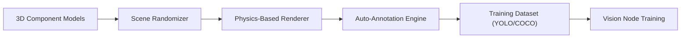

<p align="center">
  
</p>

# 🎲 HYDRA-UMC-SYNTHETIC-DATA-GEN

<p align="center">🇺🇸 <b>English</b> | <a href="README_spa.md">🇪🇸 Español</a> | <a href="README_fra.md">🇫🇷 Français</a> | <a href="README_ita.md">🇮🇹 Italiano</a> | <a href="README_deu.md">🇩🇪 Deutsch</a> | <a href="README_zho.md">🇨🇳 简体中文</a> | <a href="README_jpn.md">🇯🇵 日本語</a></p>

### 📸 Procedural Dataset Generator for Vision AI Node Training

<p align="left">
  
  
  
</p>

---

## 1. 🛠️ TECHNICAL OVERVIEW

**HYDRA-UMC-SYNTHETIC-DATA-GEN** is the data factory for the Vision AI Node. It leverages the Digital Twin's physics and rendering engines to procedurally generate thousands of labeled images for training neural networks.

It solves the "cold start" problem for new industrial components or rare defect types by creating photorealistic 3D scenarios with automatic pixel-perfect annotation (bounding boxes, segmentation masks, and keypoints).

### Key Features:
* 🎲 **Procedural Scenarios (v0):** Real, seeded-deterministic randomization of 2D component placement, size, and color. *(implemented as real 2D placeholder shapes, not yet 3D poses/lighting/textures through HYDRA-UMC-TWIN's engine - see BUILD AND RUN below)*
* 📸 **Multi-Camera Rendering:** Generates simultaneous views from 8+ virtual cameras. *(planned - needs HYDRA-UMC-TWIN's real rendering engine)*
* 🏷️ **Automatic Labeling (v0):** Real, pixel-perfect YOLO and COCO annotation export. *(implemented for YOLO/COCO; TFRecord export is planned)*
* 🛠️ **Defect Injection (v0):** Real, randomized rectangular defect overlay per component, at a configurable probability. *(implemented as a simple real overlay - true scratch/missing-part/solder-bridge shapes are planned)*
* 📋 **Dataset Manifest & Validation (v0):** Every `generate` run writes a real `manifest.json` (reproducible-seed flag, generation parameters, and a per-image sha256 checksum) and runs real post-generation validation - scene-bounds checking, BMP-integrity checking against the exact known-good file layout, and label-distribution sanity - exiting non-zero if any real issue is found.

---

## 2. 🔄 GENERATION PIPELINE



---

## 3. 🧱 ARCHITECTURE & DESIGN DECISIONS

* **Why this generator has no `hardware/`/`firmware/`/`os/` folders.** Pure software - it renders scenes through HYDRA-UMC-TWIN's own engine rather than owning any hardware itself.
* **Why it's a sibling, not a submodule, of HYDRA-UMC-TWIN.** Dataset generation is a batch, offline workload (potentially hours of rendering) fundamentally different from the twin's own real-time loop - keeping it separate means a long export run never competes with real-time simulation for the same process's CPU/GPU time.
* **Why the entry point only prints identity/version/role today.** Andamiaje (scaffolding) stage: proving the package installs and imports cleanly precedes the real procedural randomization/rendering/annotation-export logic.
* **How this fits the rest of the ecosystem.** Renders training datasets (with automatic YOLO/COCO/TFRecord annotation) through HYDRA-UMC-TWIN's own engine, for HYDRA-UMC-VISION-NODE and HYDRA-UMC-DETECTION-HEF to train against - synthetic data instead of hand-labeling real camera footage.
* **Why v0 renders real 2D placeholder shapes instead of waiting for HYDRA-UMC-TWIN.** HYDRA-UMC-TWIN (this project's own integration parent) is itself still scaffolding - blocking dataset generation entirely on its real 3D engine would leave the annotation pipeline (the actually hard, reusable part: placement, labeling, YOLO/COCO export) untested. A real stdlib-only BMP rasterizer gives real, pixel-perfect ground truth today; swapping in TWIN's real renderer later only changes how pixels get painted, not the `Scene`/`Component`/export contracts.
* **Why bounding boxes are pixel-perfect by construction.** `export.py` reads the exact same `Component` coordinates `scene.py` placed and `render.py` painted - there is no detection model or manual labeling step in this v0 loop for annotations to drift from.
* **Why validation reuses `render.py`'s own row-size formula instead of a second, independent parser.** `validate_bmp_integrity()` imports `render.py`'s `_row_size()` directly rather than re-deriving the BMP row-padding math - one source of truth for the exact byte layout means a real future change to the writer can't silently desynchronize from the checker.
* **Why "reproducible" is a manifest field, not just an unstated property of `--seed`.** `--seed` already made generation deterministic before this change, but nothing recorded whether a given dataset on disk actually used one - a consumer had no way to tell a reproducible run from a random one after the fact. `manifest.json`'s `reproducible` flag plus a real per-image sha256 makes that claim checkable.

---

## 📂 DIRECTORY STRUCTURE

Pure software dataset generator, no own hardware design - so this project
carries no `hardware/`, `firmware/` or `os/` folders under the repository
structure policy.

```text
HYDRA-UMC-SYNTHETIC-DATA-GEN/
├── src/hydra_umc_synthetic_data_gen/
│   ├── __init__.py            # Package version
│   ├── scene.py          # Real procedural 2D scene/component generation
│   ├── render.py          # Real stdlib-only BMP rasterization
│   ├── export.py           # Real YOLO/COCO annotation export
│   ├── manifest.py           # Real dataset manifest.json (seed, checksums)
│   ├── validate.py           # Real bounds/BMP-integrity/distribution checks
│   └── main.py               # Entry point + real `generate` subcommand
├── tests/               # Real tests: generation, rendering, export, end-to-end CLI
├── docs/                # Documentation and procedural guides
├── build/               # Build output (the local .venv also lives at repo root)
├── images/              # Media and diagrams
├── tools/               # ci_validate.py - manifest/CHANGELOG/docs validation used by CI
├── pyproject.toml       # Package metadata, dependencies, odometer version
├── bump_version.py      # Odometer-style version bump (used by build.sh/.bat)
├── bump_manifest_version.py # Syncs hydra-umc.project.json's version to the native one (--sync)
├── build.sh / build.bat # venv + editable install (with dev extras) + real tests + compile-check
└── run.sh / run.bat     # Runs the entry point from the local venv (forwards args, e.g. `generate`)
```

---

## 🏗️ BUILD AND RUN GUIDE

Requires Python 3.10+.

```bash
# Linux / macOS
./build.sh   # odometer version bump, creates .venv, installs the package
             # in editable mode (with dev extras), runs the real test
             # suite, compile-checks all of src/
./run.sh     # runs the entry point from .venv, prints name + version + role
```

```bat
:: Windows
build.bat
run.bat
```

`build.sh`/`build.bat` bump this project's own `pyproject.toml` version following the ecosystem's "odometer" rule (PATCH+1, carrying into MINOR past 9) before every real build, run the real test suite (`pytest tests/`), then compile-check the source with `python -m compileall`.

The real `generate` subcommand writes a real dataset to disk:

```bash
./run.sh generate --out dataset/ --count 20 --components 6 --defect-rate 0.3 --seed 42 --format both

# Windows
run.bat generate --out dataset\ --count 20 --components 6 --defect-rate 0.3 --seed 42 --format both
```

Writes real BMP images to `dataset/images/`, real YOLO labels to `dataset/labels/` + `dataset/classes.txt`, and/or a real `dataset/annotations.json` in COCO format, depending on `--format`. A given `--seed` makes the dataset byte-for-byte reproducible.

Every run also writes a real `dataset/manifest.json` and validates its own output:

```
Generated 20 scene(s) -> dataset/images
Total labeled components (incl. defects): 150
Annotations exported as: both
Reproducible seed: yes (seed=42)
Manifest written -> dataset/manifest.json
Validation: OK (scene bounds, BMP integrity, label distribution)
```

```json
{
  "seed": 42,
  "reproducible": true,
  "count": 20,
  "scenes": [
    { "image": "scene_0000.bmp", "num_components": 7,
      "label_counts": {"bracket": 1, "bolt": 2, "gear": 2, "defect": 1, "connector": 1},
      "sha256": "2301c6974673d9f6a408d7a4b746d236d0ec98b535064884b7a3929645a8f2eb" }
  ],
  "validation_issues": []
}
```

If validation finds a real problem (an out-of-range component, a truncated/corrupt BMP, or a defect rate that drifted far from `--defect-rate`), `generate` exits `1` and lists every issue instead of silently shipping a bad dataset.

---

## 🚀 ROADMAP
* **Phase 1:** Digital Twin synchronization with real-time hardware telemetry and sub-10ms latency.
* **Phase 2:** Physics Replica integration with industrial-grade simulators (Isaac Sim) and deformable body support.
* **Phase 3:** Node Healing automated recovery patterns for decentralized failover and early sensor degradation detection.
* **Phase 4:** GAN-based texture refinement for hyper-realistic industrial materials and photorealistic dataset generation.

---

## 🔗 Related Projects

This project is part of the HYDRA-UMC robotics ecosystem by the same author (JuanenRac / Electro Hobby 3D). Worth knowing about, since a request might actually be about one of these rather than this repository.

**Parent Project**
- **[HYDRA-UMC-TWIN](https://github.com/JuanenRac/HYDRA-UMC-TWIN)** — integration hub for the digital-twin engine, with a real version-compatibility sync contract; the parent this repo is one specific simulation service of, within its own digital-twin engine.

**Sibling Projects** — the other simulation services of HYDRA-UMC-TWIN's own digital-twin engine
- **[HYDRA-UMC-PHYSICS-REPLICA](https://github.com/JuanenRac/HYDRA-UMC-PHYSICS-REPLICA)** — real forward kinematics and joint-limit validation over a real URDF subset.
- **[HYDRA-UMC-HIL-BRIDGE](https://github.com/JuanenRac/HYDRA-UMC-HIL-BRIDGE)** — real hardware-in-the-loop safety interlock routing commands between simulation and real hardware.

**Directly Related**
- **[HYDRA-UMC-VISION-NODE](https://github.com/JuanenRac/HYDRA-UMC-VISION-NODE)** — integration hub for the Hailo-8 vision pipeline, with a real per-stage hardware-readiness check — trained on the datasets this project generates.
- **[HYDRA-UMC-DETECTION-HEF](https://github.com/JuanenRac/HYDRA-UMC-DETECTION-HEF)** — real compiled-model registry with Hailo-architecture/checksum safe-load verification — trained on the datasets this project generates.

**Also Part of the Ecosystem**

*Core Hardware & Platform*
- **[HYDRA-UMC](https://github.com/JuanenRac/HYDRA-UMC)** — the physical robot-arm motherboard: CM5 host + dual-core STM32H745, orchestrating up to 8 tool arms over CAN-OTA/SPI-OTA.
- **[HYDRA-UMC-OS](https://github.com/JuanenRac/HYDRA-UMC-OS)** — reproducible Raspberry Pi OS product layer for the CM5: read-only agent, validated config/profiles, WiFi first-contact provisioning.
- **[HYDRA-UMC-SDK](https://github.com/JuanenRac/HYDRA-UMC-SDK)** — the shared JSON-Schema contract and safety-gate boundary every bridge validates its commands against.

*Core Backend & Clients*
- **[HYDRA-UMC-SERVER](https://github.com/JuanenRac/HYDRA-UMC-SERVER)** — the real headless backend (REST/WebSocket) every control client actually talks to.
- **[HYDRA-UMC-STUDIO](https://github.com/JuanenRac/HYDRA-UMC-STUDIO)** — web control dashboard with real-time multi-robot 3D visualization.
- **[HYDRA-UMC-SUITE](https://github.com/JuanenRac/HYDRA-UMC-SUITE)** — desktop (PySide6) swarm command center for multiple servers at once, packaged as a standalone executable.
- **[HYDRA-UMC-ANDROID-CONTROL](https://github.com/JuanenRac/HYDRA-UMC-ANDROID-CONTROL)** — native Android control app with biometric login and a paired Wear OS companion.
- **[HYDRA-UMC-IOS-CONTROL](https://github.com/JuanenRac/HYDRA-UMC-IOS-CONTROL)** — iOS/iPadOS control app (Flutter) with real-time WebSocket sync.
- **[HYDRA-UMC-DSI](https://github.com/JuanenRac/HYDRA-UMC-DSI)** — native touch UI for the onboard 7" DSI touchscreen, embedded on the CM5 itself.
- **[HYDRA-UMC-EDITOR-URDF](https://github.com/JuanenRac/HYDRA-UMC-EDITOR-URDF)** — desktop graphical URDF creator/editor that pushes finished models into STUDIO's own catalog.
- **[HYDRA-UMC-BRIDGE-AMR](https://github.com/JuanenRac/HYDRA-UMC-BRIDGE-AMR)** — coordination boundary for AGV/AMR fleets via a real VDA 5050 MQTT publisher.
- **[HYDRA-UMC-BRIDGE-CNC](https://github.com/JuanenRac/HYDRA-UMC-BRIDGE-CNC)** — high-level CNC-cell coordinator with real GRBL status/control-byte access.
- **[HYDRA-UMC-BRIDGE-DROIDS](https://github.com/JuanenRac/HYDRA-UMC-BRIDGE-DROIDS)** — coordination boundary for legged/humanoid droids, with a real Boston Dynamics Spot command sender.
- **[HYDRA-UMC-BRIDGE-LASER](https://github.com/JuanenRac/HYDRA-UMC-BRIDGE-LASER)** — laser-cell safety coordinator reading 3 real key/enclosure/interlock GPIO safeguards.
- **[HYDRA-UMC-BRIDGE-OPENPNP](https://github.com/JuanenRac/HYDRA-UMC-BRIDGE-OPENPNP)** — safe high-level board-flow coordinator for OpenPnP pick-and-place.
- **[HYDRA-UMC-BRIDGE-PRINTER3D](https://github.com/JuanenRac/HYDRA-UMC-BRIDGE-PRINTER3D)** — safe coordination boundary for Moonraker/Klipper 3D printers, with real gated job commands.
- **[HYDRA-UMC-BRIDGE-ROS2](https://github.com/JuanenRac/HYDRA-UMC-BRIDGE-ROS2)** — safety coordinator with a real, lazily-imported rclpy ROS 2 transport.
- **[HYDRA-UMC-BRIDGE-UAV](https://github.com/JuanenRac/HYDRA-UMC-BRIDGE-UAV)** — coordination boundary for camera-equipped UAVs, with a real MAVLink command sender.

*URTC Tool Platform*
- **[URTC](https://github.com/JuanenRac/URTC)** — firmware for the physical Universal Robot Tool Controller PCB, 25+ tool profiles over CAN bus.
- **[URTC-FLASHER](https://github.com/JuanenRac/URTC-FLASHER)** — desktop GUI flashing tool for URTC boards, CAN-OTA plus full-chip SWD/JTAG.
- **[URTC-TESTER](https://github.com/JuanenRac/URTC-TESTER)** — desktop live CAN-bus diagnostic tool for URTC boards, one panel per tool profile.
- **[URTC-WEB-STUDIO](https://github.com/JuanenRac/URTC-WEB-STUDIO)** — browser-based alternative to URTC-TESTER via the Web Serial API, no local install needed.

*Vision AI Node (Hailo-8)*
- **[HYDRA-UMC-VISION-STREAMER](https://github.com/JuanenRac/HYDRA-UMC-VISION-STREAMER)** — real GStreamer pipeline + MediaMTX config generator with a real HailoRT integration boundary.
- **[HYDRA-UMC-VISUAL-SERVOING-API](https://github.com/JuanenRac/HYDRA-UMC-VISUAL-SERVOING-API)** — real Position-Based Visual Servoing correction law, safety-gated on upstream zone state.
- **[HYDRA-UMC-SAFETY-ZONES](https://github.com/JuanenRac/HYDRA-UMC-SAFETY-ZONES)** — real zone-breach checking and E-STOP requesting, with calibration-freshness enforcement.

*Cognitive AI Node (Hailo-10)*
- **[HYDRA-UMC-COGNITIVE-NODE](https://github.com/JuanenRac/HYDRA-UMC-COGNITIVE-NODE)** — integration hub for the Hailo-10 cognitive pipeline (LLM/VLA/voice orchestration).
- **[HYDRA-UMC-VLA-ENGINE](https://github.com/JuanenRac/HYDRA-UMC-VLA-ENGINE)** — real action-token encoding/decoding and trajectory generation for a Vision-Language-Action model.
- **[HYDRA-UMC-VOICE-UI](https://github.com/JuanenRac/HYDRA-UMC-VOICE-UI)** — real voice front-end (VAD + intent parser) with a bounded, confirmation-gated Watch relay.
- **[HYDRA-UMC-SEMANTIC-PLANNER](https://github.com/JuanenRac/HYDRA-UMC-SEMANTIC-PLANNER)** — real rule-based task decomposition and semantic error recovery over MCU error codes.
- **[HYDRA-UMC-DOCS-QA](https://github.com/JuanenRac/HYDRA-UMC-DOCS-QA)** — real stdlib-only TF-IDF document search over this ecosystem's own Markdown docs.

*Orchestration & Swarm*
- **[HYDRA-UMC-ORCHESTRATOR](https://github.com/JuanenRac/HYDRA-UMC-ORCHESTRATOR)** — integration hub with a real gRPC/Protobuf health-report contract and mission state machine.
- **[HYDRA-UMC-JOB-DISPATCHER](https://github.com/JuanenRac/HYDRA-UMC-JOB-DISPATCHER)** — real priority-based job queue with deduplication, over a real HTTP API.
- **[HYDRA-UMC-NODE-HEALING](https://github.com/JuanenRac/HYDRA-UMC-NODE-HEALING)** — real gRPC-based fleet health watchdog with retry/backoff and identity-mismatch detection.
- **[HYDRA-UMC-PATH-PLANNER-3D](https://github.com/JuanenRac/HYDRA-UMC-PATH-PLANNER-3D)** — real RRT-based 3D path planner with real obstacle/workspace collision validation.
- **[HYDRA-UMC-SWARM-SYNC](https://github.com/JuanenRac/HYDRA-UMC-SWARM-SYNC)** — real CRDT LWW-Element-Map state sync, property-tested for multi-cell convergence.

*Data & Analytics*
- **[HYDRA-UMC-DATALAKE](https://github.com/JuanenRac/HYDRA-UMC-DATALAKE)** — real sqlite3-backed time-series store with a real ingest/query HTTP API.
- **[HYDRA-UMC-ANOMALY-DETECTOR](https://github.com/JuanenRac/HYDRA-UMC-ANOMALY-DETECTOR)** — real FFT + statistical baseline anomaly detector with drift monitoring.
- **[HYDRA-UMC-PRODUCTION-REPORTS](https://github.com/JuanenRac/HYDRA-UMC-PRODUCTION-REPORTS)** — real OEE/availability calculation over DATALAKE history, with reproducible CSV export.
- **[HYDRA-UMC-TELEMETRY-COLLECTOR](https://github.com/JuanenRac/HYDRA-UMC-TELEMETRY-COLLECTOR)** — real CAN/WebSocket ingestion pipeline into DATALAKE, with sequence deduplication.

*Industrial Gateway*
- **[HYDRA-UMC-GATEWAY-INDUSTRIAL](https://github.com/JuanenRac/HYDRA-UMC-GATEWAY-INDUSTRIAL)** — integration hub relaying to industrial protocols, with a real command allowlist/backpressure layer.
- **[HYDRA-UMC-OPCUA-SERVER](https://github.com/JuanenRac/HYDRA-UMC-OPCUA-SERVER)** — real OPC-UA address space, verified with a real binary-protocol client session.
- **[HYDRA-UMC-MQTT-BROKER](https://github.com/JuanenRac/HYDRA-UMC-MQTT-BROKER)** — real MQTT broker with optional per-client authentication and topic ACLs.
- **[HYDRA-UMC-MTCONNECT-ADAPTER](https://github.com/JuanenRac/HYDRA-UMC-MTCONNECT-ADAPTER)** — real MTConnect `/probe` and `/current` XML endpoints with degraded-mode output.

*Complementary Tools & Ecosystem Operations*
- **[HYDRA-UMC-DASHBOARD-AI](https://github.com/JuanenRac/HYDRA-UMC-DASHBOARD-AI)** — Smart Summaries and Anomaly Highlighting panels over DATALAKE/ANOMALY-DETECTOR, with an honest statistical fallback.
- **[HYDRA-UMC-TOOL-CLI](https://github.com/JuanenRac/HYDRA-UMC-TOOL-CLI)** — fleet CLI with a real, stable exit-code contract, a genuine live client of HYDRA-UMC-SERVER's own API.
- **[HYDRA-UMC-WATCH](https://github.com/JuanenRac/HYDRA-UMC-WATCH)** — WearOS companion app with real haptic alerts and a paired-phone voice relay.
- **[URTC-SMART-RACK](https://github.com/JuanenRac/URTC-SMART-RACK)** — firmware for a board-mounting rack with real tool-ID decoding and Smart Idle pre-heating logic.
- **[URTC-VISION-TOOL](https://github.com/JuanenRac/URTC-VISION-TOOL)** — firmware plus a real Python vision companion for a thermal/RGB inspection tool head.
- **[HYDRA-UMC-UPDATER](https://github.com/JuanenRac/HYDRA-UMC-UPDATER)** — administrative desktop tool that discovers, clones and updates every repo in this ecosystem.
- **[HYDRA-UMC-OS-REBUILDER](https://github.com/JuanenRac/HYDRA-UMC-OS-REBUILDER)** — Windows/Linux desktop tool that builds a ready-to-flash CM5 image pre-loaded with the ecosystem's most current versions, with Raspberry-Pi-Imager-style first-boot Wi-Fi/user/SSH configuration.


---

## 📚 Documentation & Community

- **[CONTRIBUTING.md](CONTRIBUTING.md)** — tech stack and coding guidelines for a pull request.
- **[CODE_OF_CONDUCT.md](CODE_OF_CONDUCT.md)** — the standards of behavior expected in this community.
- **[SECURITY.md](SECURITY.md)** — how to report a vulnerability, and this project's own real security focus areas.
- **[SUPPORT.md](SUPPORT.md)** — where to ask questions and report bugs.
- **[LICENSE.md](LICENSE.md)** — this project's own license.

## 👤 AUTHOR
**JuanenRac** (Electro Hobby 3D)
📧 electrohobby3d@gmail.com
📺 [youtube.com/@electrohobby3d](https://youtube.com/@electrohobby3d)

## 📜 LICENSE
GPL-3.0 - See LICENSE for details.
