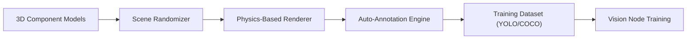

<p align="center">
  
</p>

# 🎲 HYDRA-UMC-SYNTHETIC-DATA-GEN

<p align="center">🇺🇸 <b>English</b> | <a href="README_spa.md">🇪🇸 Español</a> | <a href="README_fra.md">🇫🇷 Français</a> | <a href="README_ita.md">🇮🇹 Italiano</a> | <a href="README_deu.md">🇩🇪 Deutsch</a> | <a href="README_zho.md">🇨🇳 简体中文</a> | <a href="README_jpn.md">🇯🇵 日本語</a></p>

### 📸 Procedural Dataset Generator for Vision AI Node Training

<p align="left">
  
  
  
</p>

---

## 1. 🛠️ TECHNICAL OVERVIEW

**HYDRA-UMC-SYNTHETIC-DATA-GEN** is the data factory for the Vision AI Node. It leverages the Digital Twin's physics and rendering engines to procedurally generate thousands of labeled images for training neural networks.

It solves the "cold start" problem for new industrial components or rare defect types by creating photorealistic 3D scenarios with automatic pixel-perfect annotation (bounding boxes, segmentation masks, and keypoints).

### Key Features:
* 🎲 **Procedural Scenarios (v0):** Real, seeded-deterministic randomization of 2D component placement, size, and color. *(implemented as real 2D placeholder shapes, not yet 3D poses/lighting/textures through HYDRA-UMC-TWIN's engine - see BUILD AND RUN below)*
* 📸 **Multi-Camera Rendering:** Generates simultaneous views from 8+ virtual cameras. *(planned - needs HYDRA-UMC-TWIN's real rendering engine)*
* 🏷️ **Automatic Labeling (v0):** Real, pixel-perfect YOLO and COCO annotation export. *(implemented for YOLO/COCO; TFRecord export is planned)*
* 🛠️ **Defect Injection (v0):** Real, randomized rectangular defect overlay per component, at a configurable probability. *(implemented as a simple real overlay - true scratch/missing-part/solder-bridge shapes are planned)*
* 📋 **Dataset Manifest & Validation (v0):** Every `generate` run writes a real `manifest.json` (reproducible-seed flag, generation parameters, and a per-image sha256 checksum) and runs real post-generation validation - scene-bounds checking, BMP-integrity checking against the exact known-good file layout, and label-distribution sanity - exiting non-zero if any real issue is found.

---

## 2. 🔄 GENERATION PIPELINE



---

## 3. 🧱 ARCHITECTURE & DESIGN DECISIONS

* **Why this generator has no `hardware/`/`firmware/`/`os/` folders.** Pure software - it renders scenes through HYDRA-UMC-TWIN's own engine rather than owning any hardware itself.
* **Why it's a sibling, not a submodule, of HYDRA-UMC-TWIN.** Dataset generation is a batch, offline workload (potentially hours of rendering) fundamentally different from the twin's own real-time loop - keeping it separate means a long export run never competes with real-time simulation for the same process's CPU/GPU time.
* **Why the entry point only prints identity/version/role today.** Andamiaje (scaffolding) stage: proving the package installs and imports cleanly precedes the real procedural randomization/rendering/annotation-export logic.
* **How this fits the rest of the ecosystem.** Renders training datasets (with automatic YOLO/COCO/TFRecord annotation) through HYDRA-UMC-TWIN's own engine, for HYDRA-UMC-VISION-NODE and HYDRA-UMC-DETECTION-HEF to train against - synthetic data instead of hand-labeling real camera footage.
* **Why v0 renders real 2D placeholder shapes instead of waiting for HYDRA-UMC-TWIN.** HYDRA-UMC-TWIN (this project's own integration parent) is itself still scaffolding - blocking dataset generation entirely on its real 3D engine would leave the annotation pipeline (the actually hard, reusable part: placement, labeling, YOLO/COCO export) untested. A real stdlib-only BMP rasterizer gives real, pixel-perfect ground truth today; swapping in TWIN's real renderer later only changes how pixels get painted, not the `Scene`/`Component`/export contracts.
* **Why bounding boxes are pixel-perfect by construction.** `export.py` reads the exact same `Component` coordinates `scene.py` placed and `render.py` painted - there is no detection model or manual labeling step in this v0 loop for annotations to drift from.
* **Why validation reuses `render.py`'s own row-size formula instead of a second, independent parser.** `validate_bmp_integrity()` imports `render.py`'s `_row_size()` directly rather than re-deriving the BMP row-padding math - one source of truth for the exact byte layout means a real future change to the writer can't silently desynchronize from the checker.
* **Why "reproducible" is a manifest field, not just an unstated property of `--seed`.** `--seed` already made generation deterministic before this change, but nothing recorded whether a given dataset on disk actually used one - a consumer had no way to tell a reproducible run from a random one after the fact. `manifest.json`'s `reproducible` flag plus a real per-image sha256 makes that claim checkable.

---

## 📂 DIRECTORY STRUCTURE

Pure software dataset generator, no own hardware design - so this project
carries no `hardware/`, `firmware/` or `os/` folders under the repository
structure policy.

```text
HYDRA-UMC-SYNTHETIC-DATA-GEN/
├── src/hydra_umc_synthetic_data_gen/
│   ├── scene.py          # Real procedural 2D scene/component generation
│   ├── render.py          # Real stdlib-only BMP rasterization
│   ├── export.py           # Real YOLO/COCO annotation export
│   ├── manifest.py           # Real dataset manifest.json (seed, checksums)
│   ├── validate.py           # Real bounds/BMP-integrity/distribution checks
│   └── main.py               # Entry point + real `generate` subcommand
├── tests/               # Real tests: generation, rendering, export, end-to-end CLI
├── docs/                # Documentation and procedural guides
├── build/               # Build output (the local .venv also lives at repo root)
├── images/              # Media and diagrams
├── scripts/             # Utility scripts
├── pyproject.toml       # Package metadata, dependencies, odometer version
├── bump_version.py      # Odometer-style version bump (used by build.sh/.bat)
├── build.sh / build.bat # venv + editable install (with dev extras) + real tests + compile-check
└── run.sh / run.bat     # Runs the entry point from the local venv (forwards args, e.g. `generate`)
```

---

## 🏗️ BUILD AND RUN GUIDE

Requires Python 3.10+.

```bash
# Linux / macOS
./build.sh   # odometer version bump, creates .venv, installs the package
             # in editable mode (with dev extras), runs the real test
             # suite, compile-checks all of src/
./run.sh     # runs the entry point from .venv, prints name + version + role
```

```bat
:: Windows
build.bat
run.bat
```

`build.sh`/`build.bat` bump this project's own `pyproject.toml` version following the ecosystem's "odometer" rule (PATCH+1, carrying into MINOR past 9) before every real build, run the real test suite (`pytest tests/`), then compile-check the source with `python -m compileall`.

The real `generate` subcommand writes a real dataset to disk:

```bash
./run.sh generate --out dataset/ --count 20 --components 6 --defect-rate 0.3 --seed 42 --format both

# Windows
run.bat generate --out dataset\ --count 20 --components 6 --defect-rate 0.3 --seed 42 --format both
```

Writes real BMP images to `dataset/images/`, real YOLO labels to `dataset/labels/` + `dataset/classes.txt`, and/or a real `dataset/annotations.json` in COCO format, depending on `--format`. A given `--seed` makes the dataset byte-for-byte reproducible.

Every run also writes a real `dataset/manifest.json` and validates its own output:

```
Generated 20 scene(s) -> dataset/images
Total labeled components (incl. defects): 132
Annotations exported as: both
Reproducible seed: yes (seed=42)
Manifest written -> dataset/manifest.json
Validation: OK (scene bounds, BMP integrity, label distribution)
```

```json
{
  "seed": 42,
  "reproducible": true,
  "count": 20,
  "scenes": [
    { "image": "scene_0000.bmp", "num_components": 7,
      "label_counts": {"bolt": 3, "gear": 2, "defect": 2},
      "sha256": "7a422d05948fa43f04e738716883841ee1f493449c1023bc8dc711ffe7ffca2c" }
  ],
  "validation_issues": []
}
```

If validation finds a real problem (an out-of-range component, a truncated/corrupt BMP, or a defect rate that drifted far from `--defect-rate`), `generate` exits `1` and lists every issue instead of silently shipping a bad dataset.

---

## 🚀 ROADMAP
* **Phase 1:** Digital Twin synchronization with real-time hardware telemetry and sub-10ms latency.
* **Phase 2:** Physics Replica integration with industrial-grade simulators (Isaac Sim) and deformable body support.
* **Phase 3:** Node Healing automated recovery patterns for decentralized failover and early sensor degradation detection.
* **Phase 4:** GAN-based texture refinement for hyper-realistic industrial materials and photorealistic dataset generation.

---

## 🔗 Related Projects

This project is part of a larger robotics ecosystem by the same author (JuanenRac / Electro Hobby 3D), spanning firmware, control software, AI nodes, and fleet tooling. Worth knowing about, since a request might actually be about one of these rather than this repository.

### Family

**Parent:** **[HYDRA-UMC-TWIN](https://github.com/JuanenRac/HYDRA-UMC-TWIN)** — the integration parent whose engine renders this project's datasets.

**Siblings:**
- **[HYDRA-UMC-PHYSICS-REPLICA](https://github.com/JuanenRac/HYDRA-UMC-PHYSICS-REPLICA)** — sibling simulation service, same parent.
- **[HYDRA-UMC-HIL-BRIDGE](https://github.com/JuanenRac/HYDRA-UMC-HIL-BRIDGE)** — sibling simulation service, same parent.

### Directly Related (outside the family)

- **[HYDRA-UMC-VISION-NODE](https://github.com/JuanenRac/HYDRA-UMC-VISION-NODE)** — trained on the datasets this project generates.
- **[HYDRA-UMC-DETECTION-HEF](https://github.com/JuanenRac/HYDRA-UMC-DETECTION-HEF)** — trained on the datasets this project generates.

### Rest of the Ecosystem

**HYDRA-UMC platform** — the multi-robot micro-factory cell
- **[HYDRA-UMC](https://github.com/JuanenRac/HYDRA-UMC)** — the CM5 + STM32H745 motherboard orchestrating up to 8 robot arms.
- **[HYDRA-UMC-SERVER](https://github.com/JuanenRac/HYDRA-UMC-SERVER)** — the Express/WebSocket backend every control client talks to.
- **[HYDRA-UMC-STUDIO](https://github.com/JuanenRac/HYDRA-UMC-STUDIO)** — web-based control dashboard, multi-robot 3D visualization.
- **[HYDRA-UMC-ANDROID-CONTROL](https://github.com/JuanenRac/HYDRA-UMC-ANDROID-CONTROL)** — Android control app over Wi-Fi/Bluetooth.
- **[HYDRA-UMC-IOS-CONTROL](https://github.com/JuanenRac/HYDRA-UMC-IOS-CONTROL)** — iOS/iPadOS control app built in Flutter.
- **[HYDRA-UMC-SUITE](https://github.com/JuanenRac/HYDRA-UMC-SUITE)** — desktop swarm command center (Python/PySide6).
- **[HYDRA-UMC-EDITOR-URDF](https://github.com/JuanenRac/HYDRA-UMC-EDITOR-URDF)** — desktop URDF model editor for the robot catalog.
- **[HYDRA-UMC-DSI](https://github.com/JuanenRac/HYDRA-UMC-DSI)** — native touch UI for the onboard DSI touchscreen.

**URTC platform** — the tool head controller every HYDRA-UMC robot arm carries
- **[URTC](https://github.com/JuanenRac/URTC)** — CAN bus tool head controller, 25 tool profiles.
- **[URTC-FLASHER](https://github.com/JuanenRac/URTC-FLASHER)** — desktop CAN-OTA + SWD/JTAG flashing tool.
- **[URTC-TESTER](https://github.com/JuanenRac/URTC-TESTER)** — desktop live CAN-bus diagnostic tool.
- **[URTC-WEB-STUDIO](https://github.com/JuanenRac/URTC-WEB-STUDIO)** — browser-based alternative via Web Serial API.

**🎥 Vision AI Node (Hailo-8)**
- [HYDRA-UMC-VISION-NODE](https://github.com/JuanenRac/HYDRA-UMC-VISION-NODE)
- [HYDRA-UMC-VISION-STREAMER](https://github.com/JuanenRac/HYDRA-UMC-VISION-STREAMER)
- [HYDRA-UMC-DETECTION-HEF](https://github.com/JuanenRac/HYDRA-UMC-DETECTION-HEF)
- [HYDRA-UMC-SAFETY-ZONES](https://github.com/JuanenRac/HYDRA-UMC-SAFETY-ZONES)
- [HYDRA-UMC-VISUAL-SERVOING-API](https://github.com/JuanenRac/HYDRA-UMC-VISUAL-SERVOING-API)

**🧠 Cognitive AI Node (Hailo-10)**
- [HYDRA-UMC-COGNITIVE-NODE](https://github.com/JuanenRac/HYDRA-UMC-COGNITIVE-NODE)
- [HYDRA-UMC-VLA-ENGINE](https://github.com/JuanenRac/HYDRA-UMC-VLA-ENGINE)
- [HYDRA-UMC-VOICE-UI](https://github.com/JuanenRac/HYDRA-UMC-VOICE-UI)
- [HYDRA-UMC-SEMANTIC-PLANNER](https://github.com/JuanenRac/HYDRA-UMC-SEMANTIC-PLANNER)
- [HYDRA-UMC-DOCS-QA](https://github.com/JuanenRac/HYDRA-UMC-DOCS-QA)

**🐝 Orchestration & Swarm**
- [HYDRA-UMC-ORCHESTRATOR](https://github.com/JuanenRac/HYDRA-UMC-ORCHESTRATOR)
- [HYDRA-UMC-SWARM-SYNC](https://github.com/JuanenRac/HYDRA-UMC-SWARM-SYNC)
- [HYDRA-UMC-PATH-PLANNER-3D](https://github.com/JuanenRac/HYDRA-UMC-PATH-PLANNER-3D)
- [HYDRA-UMC-JOB-DISPATCHER](https://github.com/JuanenRac/HYDRA-UMC-JOB-DISPATCHER)
- [HYDRA-UMC-NODE-HEALING](https://github.com/JuanenRac/HYDRA-UMC-NODE-HEALING)

**📊 Data & Analytics**
- [HYDRA-UMC-DATALAKE](https://github.com/JuanenRac/HYDRA-UMC-DATALAKE)
- [HYDRA-UMC-TELEMETRY-COLLECTOR](https://github.com/JuanenRac/HYDRA-UMC-TELEMETRY-COLLECTOR)
- [HYDRA-UMC-ANOMALY-DETECTOR](https://github.com/JuanenRac/HYDRA-UMC-ANOMALY-DETECTOR)
- [HYDRA-UMC-PRODUCTION-REPORTS](https://github.com/JuanenRac/HYDRA-UMC-PRODUCTION-REPORTS)

**🏭 Industrial Gateway**
- [HYDRA-UMC-GATEWAY-INDUSTRIAL](https://github.com/JuanenRac/HYDRA-UMC-GATEWAY-INDUSTRIAL)
- [HYDRA-UMC-OPCUA-SERVER](https://github.com/JuanenRac/HYDRA-UMC-OPCUA-SERVER)
- [HYDRA-UMC-MQTT-BROKER](https://github.com/JuanenRac/HYDRA-UMC-MQTT-BROKER)
- [HYDRA-UMC-MTCONNECT-ADAPTER](https://github.com/JuanenRac/HYDRA-UMC-MTCONNECT-ADAPTER)

**🛠️ Complementary Tools**
- [URTC-SMART-RACK](https://github.com/JuanenRac/URTC-SMART-RACK)
- [URTC-VISION-TOOL](https://github.com/JuanenRac/URTC-VISION-TOOL)
- [HYDRA-UMC-WATCH](https://github.com/JuanenRac/HYDRA-UMC-WATCH)
- [HYDRA-UMC-TOOL-CLI](https://github.com/JuanenRac/HYDRA-UMC-TOOL-CLI)
- [HYDRA-UMC-DASHBOARD-AI](https://github.com/JuanenRac/HYDRA-UMC-DASHBOARD-AI)


## 👤 AUTHOR
**JuanenRac** (Electro Hobby 3D)
📧 electrohobby3d@gmail.com

## 📜 LICENSE
GPL-3.0 - See LICENSE for details.
