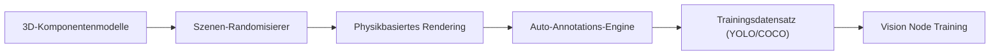

<p align="center">
  
</p>

# 🎲 HYDRA-UMC-SYNTHETIC-DATA-GEN

<p align="center"><a href="README.md">🇺🇸 English</a> | <a href="README_spa.md">🇪🇸 Español</a> | <a href="README_fra.md">🇫🇷 Français</a> | <a href="README_ita.md">🇮🇹 Italiano</a> | 🇩🇪 <b>Deutsch</b> | <a href="README_zho.md">🇨🇳 简体中文</a> | <a href="README_jpn.md">🇯🇵 日本語</a></p>

### 📸 Prozeduraler Datensatz-Generator für das Vision AI Node Training

<p align="left">
  
  
  
</p>

---

## 1. 🛠️ TECHNISCHER ÜBERBLICK

**HYDRA-UMC-SYNTHETIC-DATA-GEN** ist die Datenfabrik für den Vision AI Node. Er nutzt die Physik- und Rendering-Engines des Digital Twin, um prozedural Tausende von beschrifteten Bildern für das Training neuronaler Netze zu generieren.

Er löst das "Kaltstart"-Problem für neue industrielle Komponenten oder seltene Defekttypen, indem er fotorealistische 3D-Szenarien mit automatischer, pixelgenauer Annotation (Bounding Boxes, Segmentierungsmasken und Keypoints) erstellt.

### Hauptmerkmale:
* 🎲 **Prozedurale Szenarien (v0):** Echte, deterministische (seed-basierte) Randomisierung von Position, Größe und Farbe von 2D-Komponenten. *(implementiert als echte 2D-Platzhalterformen, noch keine 3D-Posen/Beleuchtung/Texturen über die Engine von HYDRA-UMC-TWIN - siehe BUILD UND RUN unten)*
* 📸 **Multi-Kamera-Rendering:** Generiert simultane Ansichten von 8+ virtuellen Kameras. *(geplant - benötigt die echte Rendering-Engine von HYDRA-UMC-TWIN)*
* 🏷️ **Automatische Beschriftung (v0):** Echter, pixelgenauer Export in YOLO und COCO. *(implementiert für YOLO/COCO; TFRecord-Export ist geplant)*
* 🛠️ **Defekt-Injektion (v0):** Echte, zufällige rechteckige Überlagerung pro Komponente, mit konfigurierbarer Wahrscheinlichkeit. *(implementiert als einfache echte Überlagerung - echte Kratzer-/Fehlteil-/Lötbrücken-Formen sind geplant)*
* 📋 **Datensatz-Manifest & Validierung (v0):** Jeder `generate`-Lauf schreibt eine echte `manifest.json` (reproduzierbares-Seed-Flag, Erzeugungsparameter und eine echte sha256-Prüfsumme pro Bild) und führt eine echte Nach-Generierungs-Validierung durch - Szenengrenzen, BMP-Integrität gegen das bekannte reale Dateilayout, und Plausibilität der Label-Verteilung - und beendet sich mit einem Fehlercode ungleich null, falls ein echtes Problem gefunden wird.

---

## 2. 🔄 GENERIERUNGS-PIPELINE



---

## 3. 🧱 ARCHITEKTUR & DESIGNENTSCHEIDUNGEN

* **Warum dieser Generator keine `hardware/`/`firmware/`/`os/`-Ordner hat.** Reine Software - er rendert Szenen über die eigene Engine von HYDRA-UMC-TWIN, statt selbst Hardware zu besitzen.
* **Warum er Geschwister, kein Submodul, von HYDRA-UMC-TWIN ist.** Die Datensatzerzeugung ist eine Batch-, Offline-Arbeitslast (potenziell Stunden an Rendering) - grundlegend anders als die eigene Echtzeitschleife des Zwillings - sie getrennt zu halten bedeutet, dass ein langer Export nie mit der Echtzeitsimulation um die CPU/GPU desselben Prozesses konkurriert.
* **Warum der Einstiegspunkt heute nur Identität/Version/Rolle ausgibt.** Andamiaje-Stadium: der Nachweis, dass das Paket sich sauber installieren und importieren lässt, geht der echten Logik für prozedurale Zufallsgenerierung/Rendering/Annotationsexport voraus.
* **Wie sich das ins restliche Ökosystem einfügt.** Rendert Trainingsdatensätze (mit automatischer YOLO/COCO/TFRecord-Annotation) über die eigene Engine von HYDRA-UMC-TWIN, damit HYDRA-UMC-VISION-NODE und HYDRA-UMC-DETECTION-HEF damit trainieren können - synthetische Daten statt manueller Beschriftung echter Kameraaufnahmen.
* **Warum v0 echte 2D-Platzhalterformen rendert, statt auf HYDRA-UMC-TWIN zu warten.** HYDRA-UMC-TWIN (das eigene Integrations-Elternprojekt) befindet sich selbst noch im Andamiaje-Stadium - die Datensatzerzeugung vollständig an seine echte 3D-Engine zu binden würde die Annotations-Pipeline (den eigentlich schwierigen, wiederverwendbaren Teil: Platzierung, Beschriftung, YOLO/COCO-Export) ungetestet lassen. Ein echter, rein stdlib-basierter BMP-Rasterizer liefert schon heute echte, pixelgenaue Ground-Truth-Daten - die spätere Ersetzung durch die echte Engine von TWIN ändert nur, wie Pixel gemalt werden, nicht die `Scene`/`Component`/Export-Verträge.
* **Warum Bounding Boxes durch Konstruktion pixelgenau sind.** `export.py` liest genau dieselben `Component`-Koordinaten, die `scene.py` platziert und `render.py` gemalt hat - es gibt in dieser v0-Schleife kein Erkennungsmodell und keinen manuellen Beschriftungsschritt, von dem Annotationen abweichen könnten.
* **Warum die Validierung `render.py`s eigene Zeilengrößen-Formel wiederverwendet statt eines zweiten, unabhängigen Parsers.** `validate_bmp_integrity()` importiert `_row_size()` direkt aus `render.py`, statt die BMP-Zeilenauffüllung neu herzuleiten - eine einzige Quelle der Wahrheit für das exakte Byte-Layout verhindert, dass sich eine künftige echte Änderung im Writer stillschweigend vom Prüfer desynchronisiert.
* **Warum "reproduzierbar" ein Manifest-Feld ist, nicht nur eine unausgesprochene Eigenschaft von `--seed`.** `--seed` machte die Generierung schon vor dieser Änderung deterministisch, aber nichts hielt fest, ob ein gegebener Datensatz auf der Festplatte tatsächlich einen Seed verwendet hatte - ein Konsument hatte keine Möglichkeit, im Nachhinein einen reproduzierbaren von einem zufälligen Lauf zu unterscheiden. Das `reproducible`-Flag von `manifest.json` plus ein echtes sha256 pro Bild macht diese Behauptung überprüfbar.

---

## 📂 VERZEICHNISSTRUKTUR

Reiner Software-Datensatzgenerator ohne eigenes Hardware-Design - daher
hat dieses Projekt keine Ordner `hardware/`, `firmware/` oder `os/` (siehe
der Repository-Strukturpolitik.

```text
HYDRA-UMC-SYNTHETIC-DATA-GEN/
├── src/hydra_umc_synthetic_data_gen/
│   ├── __init__.py            # Paketversion
│   ├── scene.py          # Echte prozedurale Generierung von 2D-Szenen/-Komponenten
│   ├── render.py          # Echte, rein stdlib-basierte BMP-Rasterisierung
│   ├── export.py           # Echter YOLO-/COCO-Annotationsexport
│   ├── manifest.py           # Echte manifest.json des Datensatzes (Seed, Prüfsummen)
│   ├── validate.py           # Echte Validierung: Grenzen/BMP-Integrität/Verteilung
│   └── main.py               # Einstiegspunkt + echtes `generate`-Subcommand
├── tests/               # Echte Tests: Generierung, Rendering, Export, End-to-End-CLI
├── docs/                # Dokumentation und prozedurale Anleitungen
├── build/               # Build-Ausgabe (das lokale .venv liegt ebenfalls im Repo-Root)
├── images/              # Medien und Diagramme
├── tools/               # ci_validate.py - Manifest-/CHANGELOG-/Doku-Validierung, von der CI genutzt
├── pyproject.toml       # Paket-Metadaten, Abhängigkeiten, Kilometerzähler-Version
├── bump_version.py      # Kilometerzähler-artiger Versions-Bump (von build.sh/.bat verwendet)
├── bump_manifest_version.py # Synchronisiert die Version von hydra-umc.project.json mit der nativen (--sync)
├── build.sh / build.bat # venv + editierbare Installation (mit Dev-Extras) + echte Tests + Compile-Check
└── run.sh / run.bat     # Führt den Einstiegspunkt aus dem lokalen venv aus (leitet Argumente weiter, z. B. `generate`)
```

---

## 🏗️ BUILD UND RUN

Erfordert Python 3.10+.

```bash
# Linux / macOS
./build.sh   # Kilometerzähler-Versions-Bump, erstellt .venv, installiert
             # das Paket im editierbaren Modus (mit Dev-Extras), führt die
             # echte Testsuite aus, Compile-Check von src/
./run.sh     # führt den Einstiegspunkt aus .venv aus, gibt Name + Version + Rolle aus
```

```bat
:: Windows
build.bat
run.bat
```

`build.sh`/`build.bat` erhöhen die Version der eigenen `pyproject.toml` dieses Projekts nach der "Kilometerzähler"-Regel des Ökosystems (PATCH+1, mit Übertrag auf MINOR nach 9) vor jedem echten Build, führen die echte Testsuite aus (`pytest tests/`), und führen anschließend einen Compile-Check des Quellcodes mit `python -m compileall` durch.

Das echte `generate`-Subcommand schreibt einen echten Datensatz auf die Festplatte:

```bash
./run.sh generate --out dataset/ --count 20 --components 6 --defect-rate 0.3 --seed 42 --format both

# Windows
run.bat generate --out dataset\ --count 20 --components 6 --defect-rate 0.3 --seed 42 --format both
```

Schreibt echte BMP-Bilder nach `dataset/images/`, echte YOLO-Labels nach `dataset/labels/` + `dataset/classes.txt`, und/oder eine echte `dataset/annotations.json` im COCO-Format, je nach `--format`. Ein gegebener `--seed` macht den Datensatz byte-genau reproduzierbar.

Jeder Lauf schreibt außerdem eine echte `dataset/manifest.json` und validiert seine eigene Ausgabe:

```
Generated 20 scene(s) -> dataset/images
Total labeled components (incl. defects): 132
Annotations exported as: both
Reproducible seed: yes (seed=42)
Manifest written -> dataset/manifest.json
Validation: OK (scene bounds, BMP integrity, label distribution)
```

```json
{
  "seed": 42,
  "reproducible": true,
  "count": 20,
  "scenes": [
    { "image": "scene_0000.bmp", "num_components": 7,
      "label_counts": {"bolt": 3, "gear": 2, "defect": 2},
      "sha256": "7a422d05948fa43f04e738716883841ee1f493449c1023bc8dc711ffe7ffca2c" }
  ],
  "validation_issues": []
}
```

Findet die Validierung ein echtes Problem (eine Komponente außerhalb der Grenzen, eine abgeschnittene/beschädigte BMP-Datei, oder eine Defektrate, die stark von `--defect-rate` abweicht), beendet sich `generate` mit Code `1` und listet jedes Problem auf, statt stillschweigend einen fehlerhaften Datensatz auszuliefern.

---

## 🚀 FAHRPLAN
* **Phase 1:** Digital-Twin-Synchronisation mit Echtzeit-Hardware-Telemetrie und Sub-10ms-Latenz.
* **Phase 2:** Physics Replica-Integration mit industriellen Simulatoren (Isaac Sim) und Unterstützung für verformbare Körper.
* **Phase 3:** Automatisierte Wiederherstellungsmuster von Node Healing für dezentrales Failover und frühzeitige Erkennung von Sensordegradation.
* **Phase 4:** GAN-basierte Texturverfeinerung für hyperrealistische Industriematerialien und fotorealistische Datensatzgenerierung.

---

## 🔗 Verwandte Projekte

Dieses Projekt ist Teil des HYDRA-UMC-Robotik-Ökosystems desselben Autors (JuanenRac / Electro Hobby 3D). Gut zu wissen, da eine Anfrage eigentlich eines dieser Projekte betreffen könnte statt dieses Repositorys.

**Übergeordnetes Projekt**
- **[HYDRA-UMC-TWIN](https://github.com/JuanenRac/HYDRA-UMC-TWIN)** — Integrationsknoten für die Digital-Twin-Engine, mit einem echten Versionskompatibilitäts-Sync-Vertrag; das übergeordnete Projekt, dessen spezifischer Simulationsdienst dieses Repository innerhalb seiner eigenen Digital-Twin-Engine ist.

**Geschwisterprojekte** — die übrigen Simulationsdienste der eigenen Digital-Twin-Engine von HYDRA-UMC-TWIN
- **[HYDRA-UMC-PHYSICS-REPLICA](https://github.com/JuanenRac/HYDRA-UMC-PHYSICS-REPLICA)** — echte Vorwärtskinematik und Gelenkgrenzenvalidierung über eine echte URDF-Teilmenge.
- **[HYDRA-UMC-HIL-BRIDGE](https://github.com/JuanenRac/HYDRA-UMC-HIL-BRIDGE)** — echte Hardware-in-the-Loop-Sicherheitsverriegelung, die Befehle zwischen Simulation und echter Hardware routet.

**Direkt verwandt**
- **[HYDRA-UMC-VISION-NODE](https://github.com/JuanenRac/HYDRA-UMC-VISION-NODE)** — Integrationsknoten für die Hailo-8-Vision-Pipeline, mit einer echten stufenweisen Hardware-Bereitschaftsprüfung — trainiert mit den Datensätzen, die dieses Projekt generiert.
- **[HYDRA-UMC-DETECTION-HEF](https://github.com/JuanenRac/HYDRA-UMC-DETECTION-HEF)** — echte Registry für kompilierte Modelle mit Hailo-Architektur-/Prüfsummen-Safe-Load-Verifizierung — trainiert mit den Datensätzen, die dieses Projekt generiert.

**Ebenfalls Teil des Ökosystems**

*Kern-Hardware & Plattform*
- **[HYDRA-UMC](https://github.com/JuanenRac/HYDRA-UMC)** — das physische Motherboard des Roboterarms: CM5-Host + Dual-Core-STM32H745, koordiniert bis zu 8 Werkzeugarme über CAN-OTA/SPI-OTA.
- **[HYDRA-UMC-OS](https://github.com/JuanenRac/HYDRA-UMC-OS)** — reproduzierbare Raspberry-Pi-OS-Produktschicht für den CM5: schreibgeschützter Agent, validierte Konfiguration/Profile, WiFi-Ersteinrichtung.
- **[HYDRA-UMC-SDK](https://github.com/JuanenRac/HYDRA-UMC-SDK)** — der gemeinsame JSON-Schema-Vertrag und die Sicherheitsschranke, gegen die jede Bridge ihre Befehle validiert.

*Kern-Backend & Clients*
- **[HYDRA-UMC-SERVER](https://github.com/JuanenRac/HYDRA-UMC-SERVER)** — das reale Headless-Backend (REST/WebSocket), mit dem jeder Steuerungsclient tatsächlich spricht.
- **[HYDRA-UMC-STUDIO](https://github.com/JuanenRac/HYDRA-UMC-STUDIO)** — Web-Steuerungs-Dashboard mit Echtzeit-3D-Visualisierung mehrerer Roboter.
- **[HYDRA-UMC-SUITE](https://github.com/JuanenRac/HYDRA-UMC-SUITE)** — Desktop-Schwarmleitstand (PySide6) für mehrere Server gleichzeitig, verpackt als eigenständige ausführbare Datei.
- **[HYDRA-UMC-ANDROID-CONTROL](https://github.com/JuanenRac/HYDRA-UMC-ANDROID-CONTROL)** — native Android-Steuerungs-App mit biometrischem Login und einer gekoppelten Wear-OS-Begleit-App.
- **[HYDRA-UMC-IOS-CONTROL](https://github.com/JuanenRac/HYDRA-UMC-IOS-CONTROL)** — iOS/iPadOS-Steuerungs-App (Flutter) mit Echtzeit-WebSocket-Synchronisierung.
- **[HYDRA-UMC-DSI](https://github.com/JuanenRac/HYDRA-UMC-DSI)** — native Touch-UI für das eingebaute 7"-DSI-Touchscreen, direkt auf dem CM5 eingebettet.
- **[HYDRA-UMC-EDITOR-URDF](https://github.com/JuanenRac/HYDRA-UMC-EDITOR-URDF)** — grafischer Desktop-URDF-Ersteller/-Editor, der fertige Modelle in STUDIOs eigenen Katalog überträgt.
- **[HYDRA-UMC-BRIDGE-AMR](https://github.com/JuanenRac/HYDRA-UMC-BRIDGE-AMR)** — Koordinationsschranke für AGV-/AMR-Flotten über einen echten VDA-5050-MQTT-Publisher.
- **[HYDRA-UMC-BRIDGE-CNC](https://github.com/JuanenRac/HYDRA-UMC-BRIDGE-CNC)** — High-Level-Koordinator für CNC-Zellen mit echtem GRBL-Status-/Steuerbyte-Zugriff.
- **[HYDRA-UMC-BRIDGE-DROIDS](https://github.com/JuanenRac/HYDRA-UMC-BRIDGE-DROIDS)** — Koordinationsschranke für laufende/humanoide Droiden, mit einem echten Boston-Dynamics-Spot-Befehlssender.
- **[HYDRA-UMC-BRIDGE-LASER](https://github.com/JuanenRac/HYDRA-UMC-BRIDGE-LASER)** — Sicherheitskoordinator für Laserzellen, liest 3 echte Schlüssel-/Gehäuse-/Verriegelungs-GPIO-Sicherungen.
- **[HYDRA-UMC-BRIDGE-OPENPNP](https://github.com/JuanenRac/HYDRA-UMC-BRIDGE-OPENPNP)** — sicherer High-Level-Koordinator für den Leiterplattenfluss von OpenPnP Pick-and-Place.
- **[HYDRA-UMC-BRIDGE-PRINTER3D](https://github.com/JuanenRac/HYDRA-UMC-BRIDGE-PRINTER3D)** — sichere Koordinationsschranke für Moonraker/Klipper-3D-Drucker, mit echten gesicherten Job-Befehlen.
- **[HYDRA-UMC-BRIDGE-ROS2](https://github.com/JuanenRac/HYDRA-UMC-BRIDGE-ROS2)** — Sicherheitskoordinator mit einem echten, träge importierten rclpy-ROS-2-Transport.
- **[HYDRA-UMC-BRIDGE-UAV](https://github.com/JuanenRac/HYDRA-UMC-BRIDGE-UAV)** — Koordinationsschranke für kameraausgestattete UAVs, mit einem echten MAVLink-Befehlssender.

*URTC-Werkzeugplattform*
- **[URTC](https://github.com/JuanenRac/URTC)** — Firmware für die physische Universal-Robot-Tool-Controller-Platine, 25+ Werkzeugprofile über CAN-Bus.
- **[URTC-FLASHER](https://github.com/JuanenRac/URTC-FLASHER)** — Desktop-GUI-Flash-Tool für URTC-Platinen, CAN-OTA plus Full-Chip-SWD/JTAG.
- **[URTC-TESTER](https://github.com/JuanenRac/URTC-TESTER)** — Desktop-Live-CAN-Bus-Diagnosetool für URTC-Platinen, ein Panel pro Werkzeugprofil.
- **[URTC-WEB-STUDIO](https://github.com/JuanenRac/URTC-WEB-STUDIO)** — browserbasierte Alternative zu URTC-TESTER über die Web-Serial-API, ohne lokale Installation.

*Vision-KI-Knoten (Hailo-8)*
- **[HYDRA-UMC-VISION-STREAMER](https://github.com/JuanenRac/HYDRA-UMC-VISION-STREAMER)** — echter GStreamer-Pipeline- + MediaMTX-Konfigurationsgenerator mit einer echten HailoRT-Integrationsschranke.
- **[HYDRA-UMC-VISUAL-SERVOING-API](https://github.com/JuanenRac/HYDRA-UMC-VISUAL-SERVOING-API)** — echtes Position-Based-Visual-Servoing-Korrekturgesetz, sicherheitsgesteuert nach vorgelagertem Zonenstatus.
- **[HYDRA-UMC-SAFETY-ZONES](https://github.com/JuanenRac/HYDRA-UMC-SAFETY-ZONES)** — echte Zonenverletzungsprüfung und E-STOP-Anforderung, mit erzwungener Kalibrierungsaktualität.

*Kognitiver KI-Knoten (Hailo-10)*
- **[HYDRA-UMC-COGNITIVE-NODE](https://github.com/JuanenRac/HYDRA-UMC-COGNITIVE-NODE)** — Integrationsknoten für die Hailo-10-Cognitive-Pipeline (LLM-/VLA-/Sprach-Orchestrierung).
- **[HYDRA-UMC-VLA-ENGINE](https://github.com/JuanenRac/HYDRA-UMC-VLA-ENGINE)** — echte Aktions-Token-Kodierung/-Dekodierung und Trajektoriengenerierung für ein Vision-Language-Action-Modell.
- **[HYDRA-UMC-VOICE-UI](https://github.com/JuanenRac/HYDRA-UMC-VOICE-UI)** — echtes Sprach-Frontend (VAD + Intent-Parser) mit einem begrenzten, bestätigungsgesicherten Watch-Relay.
- **[HYDRA-UMC-SEMANTIC-PLANNER](https://github.com/JuanenRac/HYDRA-UMC-SEMANTIC-PLANNER)** — echte regelbasierte Aufgabenzerlegung und semantische Fehlerbehebung über MCU-Fehlercodes.
- **[HYDRA-UMC-DOCS-QA](https://github.com/JuanenRac/HYDRA-UMC-DOCS-QA)** — echte, nur auf der Standardbibliothek basierende TF-IDF-Dokumentensuche über die eigenen Markdown-Dokumente dieses Ökosystems.

*Orchestrierung & Schwarm*
- **[HYDRA-UMC-ORCHESTRATOR](https://github.com/JuanenRac/HYDRA-UMC-ORCHESTRATOR)** — Integrationsknoten mit einem echten gRPC/Protobuf-Health-Report-Vertrag und einer Missions-Zustandsmaschine.
- **[HYDRA-UMC-JOB-DISPATCHER](https://github.com/JuanenRac/HYDRA-UMC-JOB-DISPATCHER)** — echte prioritätsbasierte Job-Queue mit Deduplizierung, über eine echte HTTP-API.
- **[HYDRA-UMC-NODE-HEALING](https://github.com/JuanenRac/HYDRA-UMC-NODE-HEALING)** — echter gRPC-basierter Flotten-Health-Watchdog mit Retry/Backoff und Identitäts-Mismatch-Erkennung.
- **[HYDRA-UMC-PATH-PLANNER-3D](https://github.com/JuanenRac/HYDRA-UMC-PATH-PLANNER-3D)** — echter RRT-basierter 3D-Pfadplaner mit echter Hindernis-/Arbeitsraum-Kollisionsvalidierung.
- **[HYDRA-UMC-SWARM-SYNC](https://github.com/JuanenRac/HYDRA-UMC-SWARM-SYNC)** — echte CRDT-LWW-Element-Map-Zustandssynchronisation, eigenschaftsgetestet auf Multi-Zellen-Konvergenz.

*Daten & Analytik*
- **[HYDRA-UMC-DATALAKE](https://github.com/JuanenRac/HYDRA-UMC-DATALAKE)** — echter sqlite3-gestützter Zeitreihenspeicher mit einer echten Ingest-/Abfrage-HTTP-API.
- **[HYDRA-UMC-ANOMALY-DETECTOR](https://github.com/JuanenRac/HYDRA-UMC-ANOMALY-DETECTOR)** — echter FFT- + statistischer Basislinien-Anomaliedetektor mit Drift-Überwachung.
- **[HYDRA-UMC-PRODUCTION-REPORTS](https://github.com/JuanenRac/HYDRA-UMC-PRODUCTION-REPORTS)** — echte OEE-/Verfügbarkeitsberechnung über den DATALAKE-Verlauf, mit reproduzierbarem CSV-Export.
- **[HYDRA-UMC-TELEMETRY-COLLECTOR](https://github.com/JuanenRac/HYDRA-UMC-TELEMETRY-COLLECTOR)** — echte CAN/WebSocket-Ingestion-Pipeline in DATALAKE, mit Sequenz-Deduplizierung.

*Industrie-Gateway*
- **[HYDRA-UMC-GATEWAY-INDUSTRIAL](https://github.com/JuanenRac/HYDRA-UMC-GATEWAY-INDUSTRIAL)** — Integrationsknoten, der zu Industrieprotokollen weiterleitet, mit einer echten Befehls-Allowlist-/Backpressure-Schicht.
- **[HYDRA-UMC-OPCUA-SERVER](https://github.com/JuanenRac/HYDRA-UMC-OPCUA-SERVER)** — echter OPC-UA-Adressraum, verifiziert mit einer echten Binärprotokoll-Client-Session.
- **[HYDRA-UMC-MQTT-BROKER](https://github.com/JuanenRac/HYDRA-UMC-MQTT-BROKER)** — echter MQTT-Broker mit optionaler Pro-Client-Authentifizierung und Topic-ACLs.
- **[HYDRA-UMC-MTCONNECT-ADAPTER](https://github.com/JuanenRac/HYDRA-UMC-MTCONNECT-ADAPTER)** — echte MTConnect-`/probe`- und `/current`-XML-Endpunkte mit Degraded-Mode-Ausgabe.

*Ergänzende Tools & Ökosystembetrieb*
- **[HYDRA-UMC-DASHBOARD-AI](https://github.com/JuanenRac/HYDRA-UMC-DASHBOARD-AI)** — Smart-Summaries- und Anomaly-Highlighting-Panels über DATALAKE/ANOMALY-DETECTOR, mit einem ehrlichen statistischen Fallback.
- **[HYDRA-UMC-TOOL-CLI](https://github.com/JuanenRac/HYDRA-UMC-TOOL-CLI)** — Flotten-CLI mit einem echten, stabilen Exit-Code-Vertrag, ein echter Live-Client der eigenen API von HYDRA-UMC-SERVER.
- **[HYDRA-UMC-WATCH](https://github.com/JuanenRac/HYDRA-UMC-WATCH)** — WearOS-Begleit-App mit echten haptischen Alarmen und einem Sprach-Relay zum gekoppelten Telefon.
- **[URTC-SMART-RACK](https://github.com/JuanenRac/URTC-SMART-RACK)** — Firmware für ein Platinenmontagegestell mit echter Werkzeug-ID-Dekodierung und Smart-Idle-Vorheizlogik.
- **[URTC-VISION-TOOL](https://github.com/JuanenRac/URTC-VISION-TOOL)** — Firmware plus ein echter Python-Vision-Begleiter für einen Thermal-/RGB-Inspektionswerkzeugkopf.
- **[HYDRA-UMC-UPDATER](https://github.com/JuanenRac/HYDRA-UMC-UPDATER)** — administratives Desktop-Tool, das jedes Repository in diesem Ökosystem entdeckt, klont und aktualisiert.


## 👤 AUTOR
**JuanenRac** (Electro Hobby 3D)
📧 electrohobby3d@gmail.com
📺 [youtube.com/@electrohobby3d](https://youtube.com/@electrohobby3d)

## 📜 LIZENZ
GPL-3.0 - Siehe LICENSE für Details.
