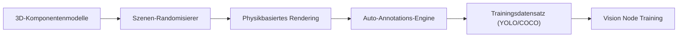

<p align="center">
  
</p>

# 🎲 HYDRA-UMC-SYNTHETIC-DATA-GEN

<p align="center"><a href="README.md">🇺🇸 English</a> | <a href="README_spa.md">🇪🇸 Español</a> | <a href="README_fra.md">🇫🇷 Français</a> | <a href="README_ita.md">🇮🇹 Italiano</a> | 🇩🇪 <b>Deutsch</b> | <a href="README_zho.md">🇨🇳 简体中文</a> | <a href="README_jpn.md">🇯🇵 日本語</a></p>

### 📸 Prozeduraler Datensatz-Generator für das Vision AI Node Training

<p align="left">
  
  
  
</p>

---

## 1. 🛠️ TECHNISCHER ÜBERBLICK

**HYDRA-UMC-SYNTHETIC-DATA-GEN** ist die Datenfabrik für den Vision AI Node. Er nutzt die Physik- und Rendering-Engines des Digital Twin, um prozedural Tausende von beschrifteten Bildern für das Training neuronaler Netze zu generieren.

Er löst das "Kaltstart"-Problem für neue industrielle Komponenten oder seltene Defekttypen, indem er fotorealistische 3D-Szenarien mit automatischer, pixelgenauer Annotation (Bounding Boxes, Segmentierungsmasken und Keypoints) erstellt.

### Hauptmerkmale:
* 🎲 **Prozedurale Szenarien (v0):** Echte, deterministische (seed-basierte) Randomisierung von Position, Größe und Farbe von 2D-Komponenten. *(implementiert als echte 2D-Platzhalterformen, noch keine 3D-Posen/Beleuchtung/Texturen über die Engine von HYDRA-UMC-TWIN - siehe BUILD UND RUN unten)*
* 📸 **Multi-Kamera-Rendering:** Generiert simultane Ansichten von 8+ virtuellen Kameras. *(geplant - benötigt die echte Rendering-Engine von HYDRA-UMC-TWIN)*
* 🏷️ **Automatische Beschriftung (v0):** Echter, pixelgenauer Export in YOLO und COCO. *(implementiert für YOLO/COCO; TFRecord-Export ist geplant)*
* 🛠️ **Defekt-Injektion (v0):** Echte, zufällige rechteckige Überlagerung pro Komponente, mit konfigurierbarer Wahrscheinlichkeit. *(implementiert als einfache echte Überlagerung - echte Kratzer-/Fehlteil-/Lötbrücken-Formen sind geplant)*

---

## 2. 🔄 GENERIERUNGS-PIPELINE



---

## 3. 🧱 ARCHITEKTUR & DESIGNENTSCHEIDUNGEN

* **Warum dieser Generator keine `hardware/`/`firmware/`/`os/`-Ordner hat.** Reine Software - er rendert Szenen über die eigene Engine von HYDRA-UMC-TWIN, statt selbst Hardware zu besitzen.
* **Warum er Geschwister, kein Submodul, von HYDRA-UMC-TWIN ist.** Die Datensatzerzeugung ist eine Batch-, Offline-Arbeitslast (potenziell Stunden an Rendering) - grundlegend anders als die eigene Echtzeitschleife des Zwillings - sie getrennt zu halten bedeutet, dass ein langer Export nie mit der Echtzeitsimulation um die CPU/GPU desselben Prozesses konkurriert.
* **Warum der Einstiegspunkt heute nur Identität/Version/Rolle ausgibt.** Andamiaje-Stadium: der Nachweis, dass das Paket sich sauber installieren und importieren lässt, geht der echten Logik für prozedurale Zufallsgenerierung/Rendering/Annotationsexport voraus.
* **Wie sich das ins restliche Ökosystem einfügt.** Rendert Trainingsdatensätze (mit automatischer YOLO/COCO/TFRecord-Annotation) über die eigene Engine von HYDRA-UMC-TWIN, damit HYDRA-UMC-VISION-NODE und HYDRA-UMC-DETECTION-HEF damit trainieren können - synthetische Daten statt manueller Beschriftung echter Kameraaufnahmen.
* **Warum v0 echte 2D-Platzhalterformen rendert, statt auf HYDRA-UMC-TWIN zu warten.** HYDRA-UMC-TWIN (das eigene Integrations-Elternprojekt) befindet sich selbst noch im Andamiaje-Stadium - die Datensatzerzeugung vollständig an seine echte 3D-Engine zu binden würde die Annotations-Pipeline (den eigentlich schwierigen, wiederverwendbaren Teil: Platzierung, Beschriftung, YOLO/COCO-Export) ungetestet lassen. Ein echter, rein stdlib-basierter BMP-Rasterizer liefert schon heute echte, pixelgenaue Ground-Truth-Daten - die spätere Ersetzung durch die echte Engine von TWIN ändert nur, wie Pixel gemalt werden, nicht die `Scene`/`Component`/Export-Verträge.
* **Warum Bounding Boxes durch Konstruktion pixelgenau sind.** `export.py` liest genau dieselben `Component`-Koordinaten, die `scene.py` platziert und `render.py` gemalt hat - es gibt in dieser v0-Schleife kein Erkennungsmodell und keinen manuellen Beschriftungsschritt, von dem Annotationen abweichen könnten.

---

## 📂 VERZEICHNISSTRUKTUR

Reiner Software-Datensatzgenerator ohne eigenes Hardware-Design - daher
hat dieses Projekt keine Ordner `hardware/`, `firmware/` oder `os/` (siehe
der Repository-Strukturpolitik.

```text
HYDRA-UMC-SYNTHETIC-DATA-GEN/
├── src/hydra_umc_synthetic_data_gen/
│   ├── scene.py          # Echte prozedurale Generierung von 2D-Szenen/-Komponenten
│   ├── render.py          # Echte, rein stdlib-basierte BMP-Rasterisierung
│   ├── export.py           # Echter YOLO-/COCO-Annotationsexport
│   └── main.py               # Einstiegspunkt + echtes `generate`-Subcommand
├── tests/               # Echte Tests: Generierung, Rendering, Export, End-to-End-CLI
├── docs/                # Dokumentation und prozedurale Anleitungen
├── build/               # Build-Ausgabe (das lokale .venv liegt ebenfalls im Repo-Root)
├── images/              # Medien und Diagramme
├── scripts/             # Utility-Skripte
├── pyproject.toml       # Paket-Metadaten, Abhängigkeiten, Kilometerzähler-Version
├── bump_version.py      # Kilometerzähler-artiger Versions-Bump (von build.sh/.bat verwendet)
├── build.sh / build.bat # venv + editierbare Installation (mit Dev-Extras) + echte Tests + Compile-Check
└── run.sh / run.bat     # Führt den Einstiegspunkt aus dem lokalen venv aus (leitet Argumente weiter, z. B. `generate`)
```

---

## 🏗️ BUILD UND RUN

Erfordert Python 3.10+.

```bash
# Linux / macOS
./build.sh   # Kilometerzähler-Versions-Bump, erstellt .venv, installiert
             # das Paket im editierbaren Modus (mit Dev-Extras), führt die
             # echte Testsuite aus, Compile-Check von src/
./run.sh     # führt den Einstiegspunkt aus .venv aus, gibt Name + Version + Rolle aus
```

```bat
:: Windows
build.bat
run.bat
```

`build.sh`/`build.bat` erhöhen die Version der eigenen `pyproject.toml` dieses Projekts nach der "Kilometerzähler"-Regel des Ökosystems (PATCH+1, mit Übertrag auf MINOR nach 9) vor jedem echten Build, führen die echte Testsuite aus (`pytest tests/`), und führen anschließend einen Compile-Check des Quellcodes mit `python -m compileall` durch.

Das echte `generate`-Subcommand schreibt einen echten Datensatz auf die Festplatte:

```bash
./run.sh generate --out dataset/ --count 20 --components 6 --defect-rate 0.3 --seed 42 --format both

# Windows
run.bat generate --out dataset\ --count 20 --components 6 --defect-rate 0.3 --seed 42 --format both
```

Schreibt echte BMP-Bilder nach `dataset/images/`, echte YOLO-Labels nach `dataset/labels/` + `dataset/classes.txt`, und/oder eine echte `dataset/annotations.json` im COCO-Format, je nach `--format`. Ein gegebener `--seed` macht den Datensatz byte-genau reproduzierbar.

---

## 🚀 ROADMAP
* **Phase 1:** Digital-Twin-Synchronisation mit Echtzeit-Hardware-Telemetrie und Sub-10ms-Latenz.
* **Phase 2:** Physics Replica-Integration mit industriellen Simulatoren (Isaac Sim) und Unterstützung für verformbare Körper.
* **Phase 3:** Automatisierte Wiederherstellungsmuster von Node Healing für dezentrales Failover und frühzeitige Erkennung von Sensordegradation.
* **Phase 4:** GAN-basierte Texturverfeinerung für hyperrealistische Industriematerialien und fotorealistische Datensatzgenerierung.

---

## 🔗 Verwandte Projekte

Dieses Projekt ist Teil eines größeren Robotik-Ökosystems desselben Autors (JuanenRac / Electro Hobby 3D), das Firmware, Steuerungssoftware, KI-Knoten und Flotten-Tools umfasst. Gut zu wissen, denn eine Anfrage könnte tatsächlich eines dieser Projekte betreffen statt dieses Repository.

### Familie

**Elternteil:** **[HYDRA-UMC-TWIN](https://github.com/JuanenRac/HYDRA-UMC-TWIN)** — der Integrations-Elternteil, dessen Engine die Datensätze dieses Projekts rendert.

**Geschwister:**
- **[HYDRA-UMC-PHYSICS-REPLICA](https://github.com/JuanenRac/HYDRA-UMC-PHYSICS-REPLICA)** — Geschwister-Simulationsdienst, gleicher Elternteil.
- **[HYDRA-UMC-HIL-BRIDGE](https://github.com/JuanenRac/HYDRA-UMC-HIL-BRIDGE)** — Geschwister-Simulationsdienst, gleicher Elternteil.

### Direkte Beziehung (außerhalb der Familie)

- **[HYDRA-UMC-VISION-NODE](https://github.com/JuanenRac/HYDRA-UMC-VISION-NODE)** — trainiert mit den von diesem Projekt erzeugten Datensätzen.
- **[HYDRA-UMC-DETECTION-HEF](https://github.com/JuanenRac/HYDRA-UMC-DETECTION-HEF)** — trainiert mit den von diesem Projekt erzeugten Datensätzen.

### Restliches Ökosystem

**HYDRA-UMC-Plattform** — die Multi-Roboter-Mikrofabrikzelle
- **[HYDRA-UMC](https://github.com/JuanenRac/HYDRA-UMC)** — das CM5 + STM32H745-Motherboard, das bis zu 8 Roboterarme orchestriert.
- **[HYDRA-UMC-SERVER](https://github.com/JuanenRac/HYDRA-UMC-SERVER)** — das Express/WebSocket-Backend, mit dem jeder Steuerungsclient spricht.
- **[HYDRA-UMC-STUDIO](https://github.com/JuanenRac/HYDRA-UMC-STUDIO)** — webbasiertes Steuerungs-Dashboard, Multi-Roboter-3D-Visualisierung.
- **[HYDRA-UMC-ANDROID-CONTROL](https://github.com/JuanenRac/HYDRA-UMC-ANDROID-CONTROL)** — Android-Steuerungs-App über Wi-Fi/Bluetooth.
- **[HYDRA-UMC-IOS-CONTROL](https://github.com/JuanenRac/HYDRA-UMC-IOS-CONTROL)** — iOS/iPadOS-Steuerungs-App, gebaut in Flutter.
- **[HYDRA-UMC-SUITE](https://github.com/JuanenRac/HYDRA-UMC-SUITE)** — Desktop-Schwarm-Kommandozentrale (Python/PySide6).
- **[HYDRA-UMC-EDITOR-URDF](https://github.com/JuanenRac/HYDRA-UMC-EDITOR-URDF)** — Desktop-URDF-Modelleditor für den Roboterkatalog.
- **[HYDRA-UMC-DSI](https://github.com/JuanenRac/HYDRA-UMC-DSI)** — native Touch-UI für den eingebauten DSI-Touchscreen.

**URTC-Plattform** — der Werkzeugkopf-Controller, den jeder HYDRA-UMC-Roboterarm trägt
- **[URTC](https://github.com/JuanenRac/URTC)** — CAN-Bus-Werkzeugkopf-Controller, 25 Werkzeugprofile.
- **[URTC-FLASHER](https://github.com/JuanenRac/URTC-FLASHER)** — Desktop-Tool für CAN-OTA + SWD/JTAG-Flashing.
- **[URTC-TESTER](https://github.com/JuanenRac/URTC-TESTER)** — Desktop-Tool für Live-CAN-Bus-Diagnose.
- **[URTC-WEB-STUDIO](https://github.com/JuanenRac/URTC-WEB-STUDIO)** — browserbasierte Alternative über die Web-Serial-API.

**🎥 Vision AI Node (Hailo-8)**
- [HYDRA-UMC-VISION-NODE](https://github.com/JuanenRac/HYDRA-UMC-VISION-NODE)
- [HYDRA-UMC-VISION-STREAMER](https://github.com/JuanenRac/HYDRA-UMC-VISION-STREAMER)
- [HYDRA-UMC-DETECTION-HEF](https://github.com/JuanenRac/HYDRA-UMC-DETECTION-HEF)
- [HYDRA-UMC-SAFETY-ZONES](https://github.com/JuanenRac/HYDRA-UMC-SAFETY-ZONES)
- [HYDRA-UMC-VISUAL-SERVOING-API](https://github.com/JuanenRac/HYDRA-UMC-VISUAL-SERVOING-API)

**🧠 Cognitive AI Node (Hailo-10)**
- [HYDRA-UMC-COGNITIVE-NODE](https://github.com/JuanenRac/HYDRA-UMC-COGNITIVE-NODE)
- [HYDRA-UMC-VLA-ENGINE](https://github.com/JuanenRac/HYDRA-UMC-VLA-ENGINE)
- [HYDRA-UMC-VOICE-UI](https://github.com/JuanenRac/HYDRA-UMC-VOICE-UI)
- [HYDRA-UMC-SEMANTIC-PLANNER](https://github.com/JuanenRac/HYDRA-UMC-SEMANTIC-PLANNER)
- [HYDRA-UMC-DOCS-QA](https://github.com/JuanenRac/HYDRA-UMC-DOCS-QA)

**🐝 Orchestration & Swarm**
- [HYDRA-UMC-ORCHESTRATOR](https://github.com/JuanenRac/HYDRA-UMC-ORCHESTRATOR)
- [HYDRA-UMC-SWARM-SYNC](https://github.com/JuanenRac/HYDRA-UMC-SWARM-SYNC)
- [HYDRA-UMC-PATH-PLANNER-3D](https://github.com/JuanenRac/HYDRA-UMC-PATH-PLANNER-3D)
- [HYDRA-UMC-JOB-DISPATCHER](https://github.com/JuanenRac/HYDRA-UMC-JOB-DISPATCHER)
- [HYDRA-UMC-NODE-HEALING](https://github.com/JuanenRac/HYDRA-UMC-NODE-HEALING)

**📊 Data & Analytics**
- [HYDRA-UMC-DATALAKE](https://github.com/JuanenRac/HYDRA-UMC-DATALAKE)
- [HYDRA-UMC-TELEMETRY-COLLECTOR](https://github.com/JuanenRac/HYDRA-UMC-TELEMETRY-COLLECTOR)
- [HYDRA-UMC-ANOMALY-DETECTOR](https://github.com/JuanenRac/HYDRA-UMC-ANOMALY-DETECTOR)
- [HYDRA-UMC-PRODUCTION-REPORTS](https://github.com/JuanenRac/HYDRA-UMC-PRODUCTION-REPORTS)

**🏭 Industrial Gateway**
- [HYDRA-UMC-GATEWAY-INDUSTRIAL](https://github.com/JuanenRac/HYDRA-UMC-GATEWAY-INDUSTRIAL)
- [HYDRA-UMC-OPCUA-SERVER](https://github.com/JuanenRac/HYDRA-UMC-OPCUA-SERVER)
- [HYDRA-UMC-MQTT-BROKER](https://github.com/JuanenRac/HYDRA-UMC-MQTT-BROKER)
- [HYDRA-UMC-MTCONNECT-ADAPTER](https://github.com/JuanenRac/HYDRA-UMC-MTCONNECT-ADAPTER)

**🛠️ Complementary Tools**
- [URTC-SMART-RACK](https://github.com/JuanenRac/URTC-SMART-RACK)
- [URTC-VISION-TOOL](https://github.com/JuanenRac/URTC-VISION-TOOL)
- [HYDRA-UMC-WATCH](https://github.com/JuanenRac/HYDRA-UMC-WATCH)
- [HYDRA-UMC-TOOL-CLI](https://github.com/JuanenRac/HYDRA-UMC-TOOL-CLI)
- [HYDRA-UMC-DASHBOARD-AI](https://github.com/JuanenRac/HYDRA-UMC-DASHBOARD-AI)


## 👤 AUTOR
**JuanenRac** (Electro Hobby 3D)
📧 electrohobby3d@gmail.com

## 📜 LIZENZ
GPL-3.0 - Siehe LICENSE für Details.

## 🛠️ BUILD & RUN

Verwenden Sie den Build-Check ohne Versionierung vor einem Release-Build:

| Aktion | Windows | Linux / macOS |
|---|---|---|
| Build-Check (ohne Änderung von Version oder CHANGELOG) | `build-test.bat` | `./build-test.sh` |
| Ausführung / Entwicklung (falls vorhanden) | `run*.bat` oder `dev*.bat` | `./run*.sh` oder `./dev*.sh` |

`build-test.bat` und `build-test.sh` kompilieren oder validieren den Projekt-Stack, ohne `hydra-umc.project.json` zu erhöhen oder `CHANGELOG.md` zu verändern. Sie dürfen nur normale Compiler-Ausgaben erzeugen. Die vorhandenen Skripte `build*.bat`, `build*.sh`, `run*` und `dev*` behalten ihr projektbezogenes Versions- oder Laufzeitverhalten bei; verwenden Sie sie, wenn dieses Verhalten benötigt wird.