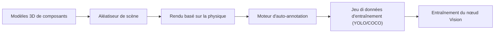

<p align="center">
  
</p>

# 🎲 HYDRA-UMC-SYNTHETIC-DATA-GEN

<p align="center"><a href="README.md">🇺🇸 English</a> | <a href="README_spa.md">🇪🇸 Español</a> | 🇫🇷 <b>Français</b> | <a href="README_ita.md">🇮🇹 Italiano</a> | <a href="README_deu.md">🇩🇪 Deutsch</a> | <a href="README_zho.md">🇨🇳 简体中文</a> | <a href="README_jpn.md">🇯🇵 日本語</a></p>

### 📸 Générateur de jeux di données procéduraux pour l'entraînement des nœuds Vision AI

<p align="left">
  
  
  
</p>

---

## 1. 🛠️ APERÇU TECHNIQUE

**HYDRA-UMC-SYNTHETIC-DATA-GEN** est l'usine de données pour le nœud Vision AI. Il exploite les moteurs de physique et de rendu du jumeau numérique pour générer de manière procédurale des milliers d'images étiquetées pour l'entraînement des réseaux neuronaux.

Il résout le problème du « démarrage à froid » pour les nouveaux composants industriels ou les types de défauts rares en créant des scénarios 3D photoréalistes avec une annotation automatique parfaite au pixel près (boîtes de délimitation, masques de segmentation et points clés).

### Caractéristiques principales :
* 🎲 **Scénarios procéduraux (v0) :** Randomisation réelle et déterministe (à partir d'une graine) de la position, la taille et la couleur de composants 2D. *(implémenté comme de vraies formes 2D de substitution, pas encore de poses/éclairage/textures 3D via le moteur de HYDRA-UMC-TWIN - voir BUILD ET RUN ci-dessous)*
* 📸 **Rendu multi-caméras :** Génère des vues simultanées à partir de plus de 8 caméras virtuelles. *(prévu - nécessite le vrai moteur de rendu de HYDRA-UMC-TWIN)*
* 🏷️ **Étiquetage automatique (v0) :** Export réel et parfait au pixel près en YOLO et COCO. *(implémenté pour YOLO/COCO ; l'export TFRecord est prévu)*
* 🛠️ **Injection de défauts (v0) :** Superposition rectangulaire réelle et aléatoire par composant, avec probabilité configurable. *(implémenté comme une simple superposition réelle - de vraies formes de rayure/pièce manquante/pont de soudure sont prévues)*
* 📋 **Manifeste de jeu de données & validation (v0) :** Chaque exécution de `generate` écrit un vrai `manifest.json` (indicateur de graine reproductible, paramètres de génération, et une vraie somme de contrôle sha256 par image) et exécute une vraie validation post-génération - limites de scène, intégrité BMP par rapport à la disposition de fichier réelle connue, et cohérence de la distribution des étiquettes - se terminant avec un code non nul si un vrai problème est trouvé.

---

## 2. 🔄 PIPELINE DE GÉNÉRATION



---

## 3. 🧱 ARCHITECTURE & DÉCISIONS DE CONCEPTION

* **Pourquoi ce générateur n'a pas de dossiers `hardware/`/`firmware/`/`os/`.** Logiciel pur - il rend des scènes via le propre moteur de HYDRA-UMC-TWIN plutôt que de posséder du matériel lui-même.
* **Pourquoi c'est un frère, pas un sous-module, de HYDRA-UMC-TWIN.** La génération de jeux de données est une charge de travail par lots, hors ligne (potentiellement des heures de rendu) fondamentalement différente de la propre boucle temps réel du jumeau - la garder séparée signifie qu'un long export ne concurrence jamais la simulation temps réel pour le CPU/GPU du même processus.
* **Pourquoi le point d'entrée ne fait qu'imprimer identité/version/rôle aujourd'hui.** Étape d'andamiaje : prouver que le paquet s'installe et s'importe proprement précède la vraie logique de randomisation procédurale/rendu/export d'annotations.
* **Comment cela s'intègre dans le reste de l'écosystème.** Rend des jeux de données d'entraînement (avec annotation automatique YOLO/COCO/TFRecord) via le propre moteur de HYDRA-UMC-TWIN, pour que HYDRA-UMC-VISION-NODE et HYDRA-UMC-DETECTION-HEF s'entraînent dessus - des données synthétiques plutôt que d'étiqueter à la main de vraies images caméra.
* **Pourquoi v0 rend de vraies formes 2D de substitution plutôt que d'attendre HYDRA-UMC-TWIN.** HYDRA-UMC-TWIN (le propre parent d'intégration de ce projet) est lui-même encore à l'étape d'échafaudage - bloquer entièrement la génération de jeux de données sur son vrai moteur 3D laisserait le pipeline d'annotation (la partie réellement difficile et réutilisable : placement, étiquetage, export YOLO/COCO) non testé. Un rasteriseur BMP réel, stdlib uniquement, donne des données réelles et parfaites au pixel près dès aujourd'hui ; substituer plus tard le vrai moteur de TWIN ne change que la façon dont les pixels sont peints, pas les contrats `Scene`/`Component`/export.
* **Pourquoi les boîtes englobantes sont parfaites au pixel près par construction.** `export.py` lit exactement les mêmes coordonnées de `Component` que `scene.py` a placées et `render.py` a peintes - il n'y a aucun modèle de détection ni étape d'étiquetage manuel dans cette boucle v0 dont les annotations pourraient dériver.
* **Pourquoi la validation réutilise la propre formule de taille de ligne de `render.py` plutôt qu'un second analyseur indépendant.** `validate_bmp_integrity()` importe directement `_row_size()` de `render.py` plutôt que de re-dériver le calcul de remplissage de ligne BMP - une seule source de vérité pour la disposition exacte des octets évite qu'un futur changement réel dans l'écrivain se désynchronise silencieusement du vérificateur.
* **Pourquoi « reproductible » est un champ du manifeste, pas seulement une propriété implicite de `--seed`.** `--seed` rendait déjà la génération déterministe avant ce changement, mais rien n'enregistrait si un jeu de données donné sur disque avait réellement utilisé une graine - un consommateur n'avait aucun moyen de distinguer après coup une exécution reproductible d'une exécution aléatoire. L'indicateur `reproducible` de `manifest.json` plus une vraie somme sha256 par image rend cette affirmation vérifiable.

---

## 📂 STRUCTURE DES RÉPERTOIRES

Générateur de jeux de données purement logiciel, sans conception
matérielle propre - ce projet ne comporte donc pas de dossiers
`hardware/`, `firmware/` ni `os/`, conformément à la politique de structure du dépôt.

```text
HYDRA-UMC-SYNTHETIC-DATA-GEN/
├── src/hydra_umc_synthetic_data_gen/
│   ├── __init__.py            # Version du paquet
│   ├── scene.py          # Génération réelle de scènes/composants 2D procéduraux
│   ├── render.py          # Rastérisation BMP réelle, stdlib uniquement
│   ├── export.py           # Export réel des annotations YOLO/COCO
│   ├── manifest.py           # Vrai manifest.json du jeu de données (graine, sommes de contrôle)
│   ├── validate.py           # Vraie validation limites/intégrité BMP/distribution
│   └── main.py               # Point d'entrée + sous-commande réelle `generate`
├── tests/               # Tests réels : génération, rendu, export, CLI de bout en bout
├── docs/                # Documentation et guides procéduraux
├── build/               # Sortie de build (le .venv local vit aussi à la racine du dépôt)
├── images/              # Médias et diagrammes
├── tools/               # ci_validate.py - validation manifest/CHANGELOG/docs utilisée par la CI
├── pyproject.toml       # Métadonnées du paquet, dépendances, version compteur kilométrique
├── bump_version.py      # Incrément de version type compteur kilométrique (utilisé par build.sh/.bat)
├── bump_manifest_version.py # Synchronise la version de hydra-umc.project.json avec la version native (--sync)
├── build.sh / build.bat # venv + installation éditable (avec extras dev) + tests réels + compile-check
└── run.sh / run.bat     # Exécute le point d'entrée depuis le venv local (transmet les arguments, ex. `generate`)
```

---

## 🏗️ BUILD ET RUN

Nécessite Python 3.10+.

```bash
# Linux / macOS
./build.sh   # incrément de version compteur kilométrique, crée .venv,
             # installe le paquet en mode éditable (avec extras dev),
             # exécute la vraie suite de tests, compile-check de src/
./run.sh     # exécute le point d'entrée depuis .venv, affiche nom + version + rôle
```

```bat
:: Windows
build.bat
run.bat
```

`build.sh`/`build.bat` incrémentent la version du propre `pyproject.toml` de ce projet selon la règle "compteur kilométrique" de l'écosystème (PATCH+1, avec retenue vers MINOR au-delà de 9) avant chaque build réel, exécutent la vraie suite de tests (`pytest tests/`), puis effectuent un compile-check du code source avec `python -m compileall`.

La vraie sous-commande `generate` écrit un vrai jeu de données sur disque :

```bash
./run.sh generate --out dataset/ --count 20 --components 6 --defect-rate 0.3 --seed 42 --format both

# Windows
run.bat generate --out dataset\ --count 20 --components 6 --defect-rate 0.3 --seed 42 --format both
```

Écrit de vraies images BMP dans `dataset/images/`, de vraies étiquettes YOLO dans `dataset/labels/` + `dataset/classes.txt`, et/ou un vrai `dataset/annotations.json` au format COCO, selon `--format`. Une `--seed` donnée rend le jeu de données reproductible octet pour octet.

Chaque exécution écrit aussi un vrai `dataset/manifest.json` et valide sa propre sortie :

```
Generated 20 scene(s) -> dataset/images
Total labeled components (incl. defects): 150
Annotations exported as: both
Reproducible seed: yes (seed=42)
Manifest written -> dataset/manifest.json
Validation: OK (scene bounds, BMP integrity, label distribution)
```

```json
{
  "seed": 42,
  "reproducible": true,
  "count": 20,
  "scenes": [
    { "image": "scene_0000.bmp", "num_components": 7,
      "label_counts": {"bracket": 1, "bolt": 2, "gear": 2, "defect": 1, "connector": 1},
      "sha256": "2301c6974673d9f6a408d7a4b746d236d0ec98b535064884b7a3929645a8f2eb" }
  ],
  "validation_issues": []
}
```

Si la validation trouve un vrai problème (un composant hors limites, un BMP tronqué/corrompu, ou un taux de défauts qui a dérivé loin de `--defect-rate`), `generate` se termine avec le code `1` et liste chaque problème au lieu de livrer silencieusement un jeu de données défectueux.

---

## 🚀 FEUILLE DE ROUTE
* **Phase 1 :** Synchronisation du jumeau numérique avec la télémétrie matérielle en temps réel et latence inférieure à 10 ms.
* **Phase 2 :** Intégration de Physics Replica avec des simulateurs de classe industrielle (Isaac Sim) et prise en charge des corps déformables.
* **Phase 3 :** Modèles de récupération automatisés de Node Healing pour un basculement décentralisé et détection précoce de la dégradation des capteurs.
* **Phase 4 :** Affinement des textures basé sur les GAN pour des matériaux industriels hyperréalistes et génération de jeux de données photoréalistes.

---

## 🔗 Projets Liés

Ce projet fait partie de l'écosystème robotique HYDRA-UMC du même auteur (JuanenRac / Electro Hobby 3D). Bon à savoir, car une demande pourrait en réalité concerner l'un de ceux-ci plutôt que ce dépôt.

**Projet Parent**
- **[HYDRA-UMC-TWIN](https://github.com/JuanenRac/HYDRA-UMC-TWIN)** — hub d'intégration pour le moteur de jumeau numérique, avec un vrai contrat de synchronisation par compatibilité de version ; le parent dont ce dépôt est un service de simulation spécifique, au sein de son propre moteur de jumeau numérique.

**Projets Frères** — les autres services de simulation du propre moteur de jumeau numérique de HYDRA-UMC-TWIN
- **[HYDRA-UMC-PHYSICS-REPLICA](https://github.com/JuanenRac/HYDRA-UMC-PHYSICS-REPLICA)** — vraie cinématique directe et validation des limites articulaires sur un vrai sous-ensemble URDF.
- **[HYDRA-UMC-HIL-BRIDGE](https://github.com/JuanenRac/HYDRA-UMC-HIL-BRIDGE)** — vrai verrouillage de sécurité hardware-in-the-loop routant les commandes entre simulation et matériel réel.

**Directement Liés**
- **[HYDRA-UMC-VISION-NODE](https://github.com/JuanenRac/HYDRA-UMC-VISION-NODE)** — hub d'intégration pour le pipeline de vision Hailo-8, avec une vraie vérification de disponibilité matérielle par étape — entraîné sur les jeux de données que ce projet génère.
- **[HYDRA-UMC-DETECTION-HEF](https://github.com/JuanenRac/HYDRA-UMC-DETECTION-HEF)** — registre réel de modèles compilés avec vérification de chargement sécurisé par architecture Hailo/checksum — entraîné sur les jeux de données que ce projet génère.

**Fait Également Partie de l'Écosystème**

*Matériel & Plateforme de Base*
- **[HYDRA-UMC](https://github.com/JuanenRac/HYDRA-UMC)** — la carte mère physique du bras robotique : hôte CM5 + coprocesseur STM32H745 double cœur, coordonnant jusqu'à 8 bras-outils via CAN-OTA/SPI-OTA.
- **[HYDRA-UMC-OS](https://github.com/JuanenRac/HYDRA-UMC-OS)** — couche produit reproductible sur Raspberry Pi OS pour le CM5 : agent en lecture seule, config/profils validés, provisionnement WiFi de premier contact.
- **[HYDRA-UMC-SDK](https://github.com/JuanenRac/HYDRA-UMC-SDK)** — le contrat JSON-Schema partagé et la barrière de sécurité contre laquelle chaque bridge valide ses commandes.

*Backend Central & Clients*
- **[HYDRA-UMC-SERVER](https://github.com/JuanenRac/HYDRA-UMC-SERVER)** — le vrai backend headless (REST/WebSocket) auquel parle réellement chaque client de contrôle.
- **[HYDRA-UMC-STUDIO](https://github.com/JuanenRac/HYDRA-UMC-STUDIO)** — tableau de bord de contrôle web avec visualisation 3D multi-robot en temps réel.
- **[HYDRA-UMC-SUITE](https://github.com/JuanenRac/HYDRA-UMC-SUITE)** — centre de commande d'essaim de bureau (PySide6) pour plusieurs serveurs à la fois, empaqueté en exécutable autonome.
- **[HYDRA-UMC-ANDROID-CONTROL](https://github.com/JuanenRac/HYDRA-UMC-ANDROID-CONTROL)** — application de contrôle Android native avec connexion biométrique et un compagnon Wear OS jumelé.
- **[HYDRA-UMC-IOS-CONTROL](https://github.com/JuanenRac/HYDRA-UMC-IOS-CONTROL)** — application de contrôle iOS/iPadOS (Flutter) avec synchronisation WebSocket en temps réel.
- **[HYDRA-UMC-DSI](https://github.com/JuanenRac/HYDRA-UMC-DSI)** — interface tactile native pour l'écran tactile DSI 7" embarqué, intégrée directement sur le CM5.
- **[HYDRA-UMC-EDITOR-URDF](https://github.com/JuanenRac/HYDRA-UMC-EDITOR-URDF)** — créateur/éditeur graphique de bureau pour URDF qui envoie les modèles terminés vers le propre catalogue de STUDIO.
- **[HYDRA-UMC-BRIDGE-AMR](https://github.com/JuanenRac/HYDRA-UMC-BRIDGE-AMR)** — frontière de coordination pour les flottes AGV/AMR via un éditeur MQTT VDA 5050 réel.
- **[HYDRA-UMC-BRIDGE-CNC](https://github.com/JuanenRac/HYDRA-UMC-BRIDGE-CNC)** — coordinateur haut niveau pour cellules CNC avec accès réel au statut/octets de contrôle GRBL.
- **[HYDRA-UMC-BRIDGE-DROIDS](https://github.com/JuanenRac/HYDRA-UMC-BRIDGE-DROIDS)** — frontière de coordination pour droïdes à pattes/humanoïdes, avec un véritable émetteur de commandes Boston Dynamics Spot.
- **[HYDRA-UMC-BRIDGE-LASER](https://github.com/JuanenRac/HYDRA-UMC-BRIDGE-LASER)** — coordinateur de sécurité pour cellules laser lisant 3 vraies sécurités GPIO de clé/enceinte/verrouillage.
- **[HYDRA-UMC-BRIDGE-OPENPNP](https://github.com/JuanenRac/HYDRA-UMC-BRIDGE-OPENPNP)** — coordinateur haut niveau sûr pour le flux de cartes du pick-and-place OpenPnP.
- **[HYDRA-UMC-BRIDGE-PRINTER3D](https://github.com/JuanenRac/HYDRA-UMC-BRIDGE-PRINTER3D)** — frontière de coordination sûre pour imprimantes 3D Moonraker/Klipper, avec de vraies commandes de tâche contrôlées.
- **[HYDRA-UMC-BRIDGE-ROS2](https://github.com/JuanenRac/HYDRA-UMC-BRIDGE-ROS2)** — coordinateur de sécurité avec un vrai transport ROS 2 rclpy à importation paresseuse.
- **[HYDRA-UMC-BRIDGE-UAV](https://github.com/JuanenRac/HYDRA-UMC-BRIDGE-UAV)** — frontière de coordination pour UAV équipés de caméra, avec un véritable émetteur de commandes MAVLink.

*Plateforme d'Outils URTC*
- **[URTC](https://github.com/JuanenRac/URTC)** — firmware pour la carte physique Universal Robot Tool Controller, plus de 25 profils d'outil sur bus CAN.
- **[URTC-FLASHER](https://github.com/JuanenRac/URTC-FLASHER)** — outil de bureau à interface graphique pour flasher les cartes URTC, CAN-OTA plus SWD/JTAG puce complète.
- **[URTC-TESTER](https://github.com/JuanenRac/URTC-TESTER)** — outil de bureau de diagnostic CAN-bus en direct pour cartes URTC, un panneau par profil d'outil.
- **[URTC-WEB-STUDIO](https://github.com/JuanenRac/URTC-WEB-STUDIO)** — alternative basée navigateur à URTC-TESTER via la Web Serial API, sans installation locale.

*Nœud IA de Vision (Hailo-8)*
- **[HYDRA-UMC-VISION-STREAMER](https://github.com/JuanenRac/HYDRA-UMC-VISION-STREAMER)** — générateur réel de pipeline GStreamer + config MediaMTX, avec une vraie frontière d'intégration HailoRT.
- **[HYDRA-UMC-VISUAL-SERVOING-API](https://github.com/JuanenRac/HYDRA-UMC-VISUAL-SERVOING-API)** — vraie loi de correction Position-Based Visual Servoing, verrouillée sur l'état de zone en amont.
- **[HYDRA-UMC-SAFETY-ZONES](https://github.com/JuanenRac/HYDRA-UMC-SAFETY-ZONES)** — vraie vérification de violation de zone et demande d'E-STOP, avec application de la fraîcheur de calibration.

*Nœud IA Cognitif (Hailo-10)*
- **[HYDRA-UMC-COGNITIVE-NODE](https://github.com/JuanenRac/HYDRA-UMC-COGNITIVE-NODE)** — hub d'intégration pour le pipeline cognitif Hailo-10 (orchestration LLM/VLA/voix).
- **[HYDRA-UMC-VLA-ENGINE](https://github.com/JuanenRac/HYDRA-UMC-VLA-ENGINE)** — vrai encodage/décodage de jetons d'action et génération de trajectoire pour un modèle Vision-Language-Action.
- **[HYDRA-UMC-VOICE-UI](https://github.com/JuanenRac/HYDRA-UMC-VOICE-UI)** — vrai front-end vocal (VAD + analyseur d'intention) avec un relais Watch borné et soumis à confirmation.
- **[HYDRA-UMC-SEMANTIC-PLANNER](https://github.com/JuanenRac/HYDRA-UMC-SEMANTIC-PLANNER)** — vraie décomposition de tâches basée sur des règles et récupération sémantique d'erreurs sur les codes d'erreur MCU.
- **[HYDRA-UMC-DOCS-QA](https://github.com/JuanenRac/HYDRA-UMC-DOCS-QA)** — vraie recherche documentaire TF-IDF (bibliothèque standard uniquement) sur les propres documents Markdown de cet écosystème.

*Orchestration & Essaim*
- **[HYDRA-UMC-ORCHESTRATOR](https://github.com/JuanenRac/HYDRA-UMC-ORCHESTRATOR)** — hub d'intégration avec un vrai contrat de rapport de santé gRPC/Protobuf et une machine à états de mission.
- **[HYDRA-UMC-JOB-DISPATCHER](https://github.com/JuanenRac/HYDRA-UMC-JOB-DISPATCHER)** — vraie file de tâches basée sur la priorité avec déduplication, via une vraie API HTTP.
- **[HYDRA-UMC-NODE-HEALING](https://github.com/JuanenRac/HYDRA-UMC-NODE-HEALING)** — vrai chien de garde de santé de flotte basé sur gRPC, avec retry/backoff et détection d'incohérence d'identité.
- **[HYDRA-UMC-PATH-PLANNER-3D](https://github.com/JuanenRac/HYDRA-UMC-PATH-PLANNER-3D)** — vrai planificateur de trajectoire 3D basé sur RRT, avec vraie validation des collisions obstacle/espace de travail.
- **[HYDRA-UMC-SWARM-SYNC](https://github.com/JuanenRac/HYDRA-UMC-SWARM-SYNC)** — vraie synchronisation d'état CRDT LWW-Element-Map, testée par propriétés pour la convergence multi-cellule.

*Données & Analytique*
- **[HYDRA-UMC-DATALAKE](https://github.com/JuanenRac/HYDRA-UMC-DATALAKE)** — vrai magasin de séries temporelles basé sur sqlite3, avec une vraie API HTTP d'ingestion/requête.
- **[HYDRA-UMC-ANOMALY-DETECTOR](https://github.com/JuanenRac/HYDRA-UMC-ANOMALY-DETECTOR)** — vrai détecteur d'anomalies FFT + ligne de base statistique, avec surveillance de dérive.
- **[HYDRA-UMC-PRODUCTION-REPORTS](https://github.com/JuanenRac/HYDRA-UMC-PRODUCTION-REPORTS)** — vrai calcul OEE/disponibilité sur l'historique de DATALAKE, avec export CSV reproductible.
- **[HYDRA-UMC-TELEMETRY-COLLECTOR](https://github.com/JuanenRac/HYDRA-UMC-TELEMETRY-COLLECTOR)** — vrai pipeline d'ingestion CAN/WebSocket vers DATALAKE, avec déduplication par séquence.

*Passerelle Industrielle*
- **[HYDRA-UMC-GATEWAY-INDUSTRIAL](https://github.com/JuanenRac/HYDRA-UMC-GATEWAY-INDUSTRIAL)** — hub d'intégration relayant vers les protocoles industriels, avec une vraie couche de liste blanche de commandes/contre-pression.
- **[HYDRA-UMC-OPCUA-SERVER](https://github.com/JuanenRac/HYDRA-UMC-OPCUA-SERVER)** — vrai espace d'adressage OPC-UA, vérifié avec une vraie session client du protocole binaire.
- **[HYDRA-UMC-MQTT-BROKER](https://github.com/JuanenRac/HYDRA-UMC-MQTT-BROKER)** — vrai broker MQTT avec authentification par client optionnelle et ACL de sujets.
- **[HYDRA-UMC-MTCONNECT-ADAPTER](https://github.com/JuanenRac/HYDRA-UMC-MTCONNECT-ADAPTER)** — vrais points de terminaison XML MTConnect `/probe` et `/current`, avec sortie en mode dégradé.

*Outils Complémentaires & Opérations de l'Écosystème*
- **[HYDRA-UMC-DASHBOARD-AI](https://github.com/JuanenRac/HYDRA-UMC-DASHBOARD-AI)** — panneaux Smart Summaries et Anomaly Highlighting sur DATALAKE/ANOMALY-DETECTOR, avec un repli statistique honnête.
- **[HYDRA-UMC-TOOL-CLI](https://github.com/JuanenRac/HYDRA-UMC-TOOL-CLI)** — CLI de flotte avec un vrai contrat de codes de sortie stable, un vrai client en direct de la propre API de HYDRA-UMC-SERVER.
- **[HYDRA-UMC-WATCH](https://github.com/JuanenRac/HYDRA-UMC-WATCH)** — application compagnon WearOS avec de vraies alertes haptiques et un relais vocal vers le téléphone jumelé.
- **[URTC-SMART-RACK](https://github.com/JuanenRac/URTC-SMART-RACK)** — firmware pour un rack de montage de cartes avec décodage réel d'ID d'outil et logique de préchauffage Smart Idle.
- **[URTC-VISION-TOOL](https://github.com/JuanenRac/URTC-VISION-TOOL)** — firmware plus un vrai compagnon de vision Python pour une tête d'outil d'inspection thermique/RGB.
- **[HYDRA-UMC-UPDATER](https://github.com/JuanenRac/HYDRA-UMC-UPDATER)** — outil administratif de bureau qui découvre, clone et met à jour chaque dépôt de cet écosystème.


---

## 📚 Documentation & Communauté

- **[CONTRIBUTING.md](CONTRIBUTING.md)** — pile technologique et lignes directrices de codage pour une pull request.
- **[CODE_OF_CONDUCT.md](CODE_OF_CONDUCT.md)** — les normes de comportement attendues dans cette communauté.
- **[SECURITY.md](SECURITY.md)** — comment signaler une vulnérabilité, et les véritables axes de sécurité de ce projet.
- **[SUPPORT.md](SUPPORT.md)** — où poser des questions et signaler des bugs.
- **[LICENSE.md](LICENSE.md)** — la licence propre de ce projet.

## 👤 AUTEUR
**JuanenRac** (Electro Hobby 3D)
📧 electrohobby3d@gmail.com
📺 [youtube.com/@electrohobby3d](https://youtube.com/@electrohobby3d)

## 📜 LICENCE
GPL-3.0 - Voir le fichier LICENSE pour plus de détails.
