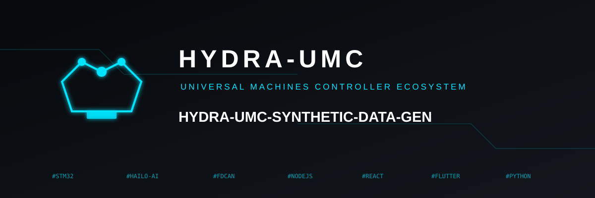
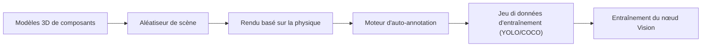

<p align="center">
  
</p>

# 🎲 HYDRA-UMC-SYNTHETIC-DATA-GEN

<p align="center"><a href="README.md">🇺🇸 English</a> | <a href="README_spa.md">🇪🇸 Español</a> | 🇫🇷 <b>Français</b> | <a href="README_ita.md">🇮🇹 Italiano</a> | <a href="README_deu.md">🇩🇪 Deutsch</a> | <a href="README_zho.md">🇨🇳 简体中文</a> | <a href="README_jpn.md">🇯🇵 日本語</a></p>

### 📸 Générateur de jeux di données procéduraux pour l'entraînement des nœuds Vision AI

<p align="left">
  
  
  
</p>

---

## 1. 🛠️ APERÇU TECHNIQUE

**HYDRA-UMC-SYNTHETIC-DATA-GEN** est l'usine de données pour le nœud Vision AI. Il exploite les moteurs de physique et de rendu du jumeau numérique pour générer de manière procédurale des milliers d'images étiquetées pour l'entraînement des réseaux neuronaux.

Il résout le problème du « démarrage à froid » pour les nouveaux composants industriels ou les types de défauts rares en créant des scénarios 3D photoréalistes avec une annotation automatique parfaite au pixel près (boîtes de délimitation, masques de segmentation et points clés).

### Caractéristiques principales :
* 🎲 **Scénarios procéduraux (v0) :** Randomisation réelle et déterministe (à partir d'une graine) de la position, la taille et la couleur de composants 2D. *(implémenté comme de vraies formes 2D de substitution, pas encore de poses/éclairage/textures 3D via le moteur de HYDRA-UMC-TWIN - voir BUILD ET RUN ci-dessous)*
* 📸 **Rendu multi-caméras :** Génère des vues simultanées à partir de plus de 8 caméras virtuelles. *(prévu - nécessite le vrai moteur de rendu de HYDRA-UMC-TWIN)*
* 🏷️ **Étiquetage automatique (v0) :** Export réel et parfait au pixel près en YOLO et COCO. *(implémenté pour YOLO/COCO ; l'export TFRecord est prévu)*
* 🛠️ **Injection de défauts (v0) :** Superposition rectangulaire réelle et aléatoire par composant, avec probabilité configurable. *(implémenté comme une simple superposition réelle - de vraies formes de rayure/pièce manquante/pont de soudure sont prévues)*
* 📋 **Manifeste de jeu de données & validation (v0) :** Chaque exécution de `generate` écrit un vrai `manifest.json` (indicateur de graine reproductible, paramètres de génération, et une vraie somme de contrôle sha256 par image) et exécute une vraie validation post-génération - limites de scène, intégrité BMP par rapport à la disposition de fichier réelle connue, et cohérence de la distribution des étiquettes - se terminant avec un code non nul si un vrai problème est trouvé.

---

## 2. 🔄 PIPELINE DE GÉNÉRATION



---

## 3. 🧱 ARCHITECTURE & DÉCISIONS DE CONCEPTION

* **Pourquoi ce générateur n'a pas de dossiers `hardware/`/`firmware/`/`os/`.** Logiciel pur - il rend des scènes via le propre moteur de HYDRA-UMC-TWIN plutôt que de posséder du matériel lui-même.
* **Pourquoi c'est un frère, pas un sous-module, de HYDRA-UMC-TWIN.** La génération de jeux de données est une charge de travail par lots, hors ligne (potentiellement des heures de rendu) fondamentalement différente de la propre boucle temps réel du jumeau - la garder séparée signifie qu'un long export ne concurrence jamais la simulation temps réel pour le CPU/GPU du même processus.
* **Pourquoi le point d'entrée ne fait qu'imprimer identité/version/rôle aujourd'hui.** Étape d'andamiaje : prouver que le paquet s'installe et s'importe proprement précède la vraie logique de randomisation procédurale/rendu/export d'annotations.
* **Comment cela s'intègre dans le reste de l'écosystème.** Rend des jeux de données d'entraînement (avec annotation automatique YOLO/COCO/TFRecord) via le propre moteur de HYDRA-UMC-TWIN, pour que HYDRA-UMC-VISION-NODE et HYDRA-UMC-DETECTION-HEF s'entraînent dessus - des données synthétiques plutôt que d'étiqueter à la main de vraies images caméra.
* **Pourquoi v0 rend de vraies formes 2D de substitution plutôt que d'attendre HYDRA-UMC-TWIN.** HYDRA-UMC-TWIN (le propre parent d'intégration de ce projet) est lui-même encore à l'étape d'échafaudage - bloquer entièrement la génération de jeux de données sur son vrai moteur 3D laisserait le pipeline d'annotation (la partie réellement difficile et réutilisable : placement, étiquetage, export YOLO/COCO) non testé. Un rasteriseur BMP réel, stdlib uniquement, donne des données réelles et parfaites au pixel près dès aujourd'hui ; substituer plus tard le vrai moteur de TWIN ne change que la façon dont les pixels sont peints, pas les contrats `Scene`/`Component`/export.
* **Pourquoi les boîtes englobantes sont parfaites au pixel près par construction.** `export.py` lit exactement les mêmes coordonnées de `Component` que `scene.py` a placées et `render.py` a peintes - il n'y a aucun modèle de détection ni étape d'étiquetage manuel dans cette boucle v0 dont les annotations pourraient dériver.
* **Pourquoi la validation réutilise la propre formule de taille de ligne de `render.py` plutôt qu'un second analyseur indépendant.** `validate_bmp_integrity()` importe directement `_row_size()` de `render.py` plutôt que de re-dériver le calcul de remplissage de ligne BMP - une seule source de vérité pour la disposition exacte des octets évite qu'un futur changement réel dans l'écrivain se désynchronise silencieusement du vérificateur.
* **Pourquoi « reproductible » est un champ du manifeste, pas seulement une propriété implicite de `--seed`.** `--seed` rendait déjà la génération déterministe avant ce changement, mais rien n'enregistrait si un jeu de données donné sur disque avait réellement utilisé une graine - un consommateur n'avait aucun moyen de distinguer après coup une exécution reproductible d'une exécution aléatoire. L'indicateur `reproducible` de `manifest.json` plus une vraie somme sha256 par image rend cette affirmation vérifiable.

---

## 📂 STRUCTURE DES RÉPERTOIRES

Générateur de jeux de données purement logiciel, sans conception
matérielle propre - ce projet ne comporte donc pas de dossiers
`hardware/`, `firmware/` ni `os/`, conformément à la politique de structure du dépôt.

```text
HYDRA-UMC-SYNTHETIC-DATA-GEN/
├── src/hydra_umc_synthetic_data_gen/
│   ├── scene.py          # Génération réelle de scènes/composants 2D procéduraux
│   ├── render.py          # Rastérisation BMP réelle, stdlib uniquement
│   ├── export.py           # Export réel des annotations YOLO/COCO
│   ├── manifest.py           # Vrai manifest.json du jeu de données (graine, sommes de contrôle)
│   ├── validate.py           # Vraie validation limites/intégrité BMP/distribution
│   └── main.py               # Point d'entrée + sous-commande réelle `generate`
├── tests/               # Tests réels : génération, rendu, export, CLI de bout en bout
├── docs/                # Documentation et guides procéduraux
├── build/               # Sortie de build (le .venv local vit aussi à la racine du dépôt)
├── images/              # Médias et diagrammes
├── scripts/             # Scripts utilitaires
├── pyproject.toml       # Métadonnées du paquet, dépendances, version compteur kilométrique
├── bump_version.py      # Incrément de version type compteur kilométrique (utilisé par build.sh/.bat)
├── build.sh / build.bat # venv + installation éditable (avec extras dev) + tests réels + compile-check
└── run.sh / run.bat     # Exécute le point d'entrée depuis le venv local (transmet les arguments, ex. `generate`)
```

---

## 🏗️ BUILD ET RUN

Nécessite Python 3.10+.

```bash
# Linux / macOS
./build.sh   # incrément de version compteur kilométrique, crée .venv,
             # installe le paquet en mode éditable (avec extras dev),
             # exécute la vraie suite de tests, compile-check de src/
./run.sh     # exécute le point d'entrée depuis .venv, affiche nom + version + rôle
```

```bat
:: Windows
build.bat
run.bat
```

`build.sh`/`build.bat` incrémentent la version du propre `pyproject.toml` de ce projet selon la règle "compteur kilométrique" de l'écosystème (PATCH+1, avec retenue vers MINOR au-delà de 9) avant chaque build réel, exécutent la vraie suite de tests (`pytest tests/`), puis effectuent un compile-check du code source avec `python -m compileall`.

La vraie sous-commande `generate` écrit un vrai jeu de données sur disque :

```bash
./run.sh generate --out dataset/ --count 20 --components 6 --defect-rate 0.3 --seed 42 --format both

# Windows
run.bat generate --out dataset\ --count 20 --components 6 --defect-rate 0.3 --seed 42 --format both
```

Écrit de vraies images BMP dans `dataset/images/`, de vraies étiquettes YOLO dans `dataset/labels/` + `dataset/classes.txt`, et/ou un vrai `dataset/annotations.json` au format COCO, selon `--format`. Une `--seed` donnée rend le jeu de données reproductible octet pour octet.

Chaque exécution écrit aussi un vrai `dataset/manifest.json` et valide sa propre sortie :

```
Generated 20 scene(s) -> dataset/images
Total labeled components (incl. defects): 132
Annotations exported as: both
Reproducible seed: yes (seed=42)
Manifest written -> dataset/manifest.json
Validation: OK (scene bounds, BMP integrity, label distribution)
```

```json
{
  "seed": 42,
  "reproducible": true,
  "count": 20,
  "scenes": [
    { "image": "scene_0000.bmp", "num_components": 7,
      "label_counts": {"bolt": 3, "gear": 2, "defect": 2},
      "sha256": "7a422d05948fa43f04e738716883841ee1f493449c1023bc8dc711ffe7ffca2c" }
  ],
  "validation_issues": []
}
```

Si la validation trouve un vrai problème (un composant hors limites, un BMP tronqué/corrompu, ou un taux de défauts qui a dérivé loin de `--defect-rate`), `generate` se termine avec le code `1` et liste chaque problème au lieu de livrer silencieusement un jeu de données défectueux.

---

## 🚀 ROADMAP
* **Phase 1 :** Synchronisation du jumeau numérique avec la télémétrie matérielle en temps réel et latence inférieure à 10 ms.
* **Phase 2 :** Intégration de Physics Replica avec des simulateurs de classe industrielle (Isaac Sim) et prise en charge des corps déformables.
* **Phase 3 :** Modèles de récupération automatisés de Node Healing pour un basculement décentralisé et détection précoce de la dégradation des capteurs.
* **Phase 4 :** Affinement des textures basé sur les GAN pour des matériaux industriels hyperréalistes et génération de jeux de données photoréalistes.

---

## 🔗 Projets Liés

Ce projet fait partie d'un écosystème robotique plus large du même auteur (JuanenRac / Electro Hobby 3D), couvrant firmware, logiciel de contrôle, nœuds IA et outillage de flotte. Bon à savoir, car une demande pourrait en réalité concerner l'un de ces projets plutôt que ce dépôt.

### Famille

**Parent :** **[HYDRA-UMC-TWIN](https://github.com/JuanenRac/HYDRA-UMC-TWIN)** — le parent d'intégration dont le moteur rend les jeux de données de ce projet.

**Frères et sœurs :**
- **[HYDRA-UMC-PHYSICS-REPLICA](https://github.com/JuanenRac/HYDRA-UMC-PHYSICS-REPLICA)** — service de simulation frère, même parent.
- **[HYDRA-UMC-HIL-BRIDGE](https://github.com/JuanenRac/HYDRA-UMC-HIL-BRIDGE)** — service de simulation frère, même parent.

### Relation Directe (hors de la famille)

- **[HYDRA-UMC-VISION-NODE](https://github.com/JuanenRac/HYDRA-UMC-VISION-NODE)** — entraîné sur les jeux de données générés par ce projet.
- **[HYDRA-UMC-DETECTION-HEF](https://github.com/JuanenRac/HYDRA-UMC-DETECTION-HEF)** — entraîné sur les jeux de données générés par ce projet.

### Reste de l'Écosystème

**Plateforme HYDRA-UMC** — la cellule de micro-usine multi-robot
- **[HYDRA-UMC](https://github.com/JuanenRac/HYDRA-UMC)** — la carte mère CM5 + STM32H745 orchestrant jusqu'à 8 bras robotiques.
- **[HYDRA-UMC-SERVER](https://github.com/JuanenRac/HYDRA-UMC-SERVER)** — le backend Express/WebSocket auquel parle chaque client de contrôle.
- **[HYDRA-UMC-STUDIO](https://github.com/JuanenRac/HYDRA-UMC-STUDIO)** — tableau de bord de contrôle web, visualisation 3D multi-robot.
- **[HYDRA-UMC-ANDROID-CONTROL](https://github.com/JuanenRac/HYDRA-UMC-ANDROID-CONTROL)** — application de contrôle Android via Wi-Fi/Bluetooth.
- **[HYDRA-UMC-IOS-CONTROL](https://github.com/JuanenRac/HYDRA-UMC-IOS-CONTROL)** — application de contrôle iOS/iPadOS construite en Flutter.
- **[HYDRA-UMC-SUITE](https://github.com/JuanenRac/HYDRA-UMC-SUITE)** — centre de commande d'essaim de bureau (Python/PySide6).
- **[HYDRA-UMC-EDITOR-URDF](https://github.com/JuanenRac/HYDRA-UMC-EDITOR-URDF)** — éditeur de modèles URDF de bureau pour le catalogue de robots.
- **[HYDRA-UMC-DSI](https://github.com/JuanenRac/HYDRA-UMC-DSI)** — interface tactile native pour l'écran DSI embarqué.

**Plateforme URTC** — le contrôleur de tête d'outil que porte chaque bras HYDRA-UMC
- **[URTC](https://github.com/JuanenRac/URTC)** — contrôleur de tête d'outil sur bus CAN, 25 profils d'outil.
- **[URTC-FLASHER](https://github.com/JuanenRac/URTC-FLASHER)** — outil de bureau de flashage CAN-OTA + SWD/JTAG.
- **[URTC-TESTER](https://github.com/JuanenRac/URTC-TESTER)** — outil de bureau de diagnostic CAN en direct.
- **[URTC-WEB-STUDIO](https://github.com/JuanenRac/URTC-WEB-STUDIO)** — alternative basée navigateur via l'API Web Serial.

**🎥 Nœud de Vision IA (Hailo-8)**
- [HYDRA-UMC-VISION-NODE](https://github.com/JuanenRac/HYDRA-UMC-VISION-NODE)
- [HYDRA-UMC-VISION-STREAMER](https://github.com/JuanenRac/HYDRA-UMC-VISION-STREAMER)
- [HYDRA-UMC-DETECTION-HEF](https://github.com/JuanenRac/HYDRA-UMC-DETECTION-HEF)
- [HYDRA-UMC-SAFETY-ZONES](https://github.com/JuanenRac/HYDRA-UMC-SAFETY-ZONES)
- [HYDRA-UMC-VISUAL-SERVOING-API](https://github.com/JuanenRac/HYDRA-UMC-VISUAL-SERVOING-API)

**🧠 Nœud Cognitif IA (Hailo-10)**
- [HYDRA-UMC-COGNITIVE-NODE](https://github.com/JuanenRac/HYDRA-UMC-COGNITIVE-NODE)
- [HYDRA-UMC-VLA-ENGINE](https://github.com/JuanenRac/HYDRA-UMC-VLA-ENGINE)
- [HYDRA-UMC-VOICE-UI](https://github.com/JuanenRac/HYDRA-UMC-VOICE-UI)
- [HYDRA-UMC-SEMANTIC-PLANNER](https://github.com/JuanenRac/HYDRA-UMC-SEMANTIC-PLANNER)
- [HYDRA-UMC-DOCS-QA](https://github.com/JuanenRac/HYDRA-UMC-DOCS-QA)

**🐝 Orchestration et Essaim**
- [HYDRA-UMC-ORCHESTRATOR](https://github.com/JuanenRac/HYDRA-UMC-ORCHESTRATOR)
- [HYDRA-UMC-SWARM-SYNC](https://github.com/JuanenRac/HYDRA-UMC-SWARM-SYNC)
- [HYDRA-UMC-PATH-PLANNER-3D](https://github.com/JuanenRac/HYDRA-UMC-PATH-PLANNER-3D)
- [HYDRA-UMC-JOB-DISPATCHER](https://github.com/JuanenRac/HYDRA-UMC-JOB-DISPATCHER)
- [HYDRA-UMC-NODE-HEALING](https://github.com/JuanenRac/HYDRA-UMC-NODE-HEALING)

**📊 Données et Analytique**
- [HYDRA-UMC-DATALAKE](https://github.com/JuanenRac/HYDRA-UMC-DATALAKE)
- [HYDRA-UMC-TELEMETRY-COLLECTOR](https://github.com/JuanenRac/HYDRA-UMC-TELEMETRY-COLLECTOR)
- [HYDRA-UMC-ANOMALY-DETECTOR](https://github.com/JuanenRac/HYDRA-UMC-ANOMALY-DETECTOR)
- [HYDRA-UMC-PRODUCTION-REPORTS](https://github.com/JuanenRac/HYDRA-UMC-PRODUCTION-REPORTS)

**🏭 Passerelle Industrielle**
- [HYDRA-UMC-GATEWAY-INDUSTRIAL](https://github.com/JuanenRac/HYDRA-UMC-GATEWAY-INDUSTRIAL)
- [HYDRA-UMC-OPCUA-SERVER](https://github.com/JuanenRac/HYDRA-UMC-OPCUA-SERVER)
- [HYDRA-UMC-MQTT-BROKER](https://github.com/JuanenRac/HYDRA-UMC-MQTT-BROKER)
- [HYDRA-UMC-MTCONNECT-ADAPTER](https://github.com/JuanenRac/HYDRA-UMC-MTCONNECT-ADAPTER)

**🛠️ Outils Complémentaires**
- [URTC-SMART-RACK](https://github.com/JuanenRac/URTC-SMART-RACK)
- [URTC-VISION-TOOL](https://github.com/JuanenRac/URTC-VISION-TOOL)
- [HYDRA-UMC-WATCH](https://github.com/JuanenRac/HYDRA-UMC-WATCH)
- [HYDRA-UMC-TOOL-CLI](https://github.com/JuanenRac/HYDRA-UMC-TOOL-CLI)
- [HYDRA-UMC-DASHBOARD-AI](https://github.com/JuanenRac/HYDRA-UMC-DASHBOARD-AI)


## 👤 AUTEUR
**JuanenRac** (Electro Hobby 3D)
📧 electrohobby3d@gmail.com

## 📜 LICENCE
GPL-3.0 - Voir le fichier LICENSE pour plus de détails.
