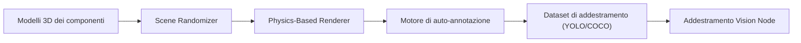

<p align="center">
  
</p>

# 🎲 HYDRA-UMC-SYNTHETIC-DATA-GEN

<p align="center"><a href="README.md">🇺🇸 English</a> | <a href="README_spa.md">🇪🇸 Español</a> | <a href="README_fra.md">🇫🇷 Français</a> | 🇮🇹 <b>Italiano</b> | <a href="README_deu.md">🇩🇪 Deutsch</a> | <a href="README_zho.md">🇨🇳 简体中文</a> | <a href="README_jpn.md">🇯🇵 日本語</a></p>

### 📸 Generatore di dataset procedurali per l'addestramento dei Vision AI Node

<p align="left">
  
  
  
</p>

---

## 1. 🛠️ PANORAMICA TECNICA

**HYDRA-UMC-SYNTHETIC-DATA-GEN** è la fabbrica di dati per i Vision AI Node. Sfrutta i motori di fisica e rendering del Digital Twin per generare proceduralmente migliaia di immagini etichettate per l'addestramento delle reti neurali.

Risolve il problema del «cold start» per i nuovi componenti industriali o i tipi di difetti rari creando scenari 3D fotorealistici con annotazioni automatiche perfette al pixel (bounding box, maschere di segmentazione e keypoint).

### Caratteristiche principali:
* 🎲 **Scenari procedurali (v0):** Randomizzazione reale e deterministica (con seed) di posizione, dimensione e colore dei componenti 2D. *(implementato come vere forme 2D segnaposto, non ancora pose/illuminazione/texture 3D tramite il motore di HYDRA-UMC-TWIN - vedi BUILD E RUN sotto)*
* 📸 **Rendering multi-camera:** Genera viste simultanee da oltre 8 telecamere virtuali. *(pianificato - richiede il vero motore di rendering di HYDRA-UMC-TWIN)*
* 🏷️ **Etichettatura automatica (v0):** Esportazione reale e perfetta al pixel in YOLO e COCO. *(implementato per YOLO/COCO; l'esportazione TFRecord è pianificata)*
* 🛠️ **Iniezione di difetti (v0):** Sovrapposizione rettangolare reale e casuale per componente, con probabilità configurabile. *(implementato come una semplice sovrapposizione reale - vere forme di graffio/parte mancante/ponte di saldatura sono pianificate)*
* 📋 **Manifesto del dataset e validazione (v0):** Ogni esecuzione di `generate` scrive un vero `manifest.json` (flag di seed riproducibile, parametri di generazione, e un vero checksum sha256 per immagine) ed esegue una vera validazione post-generazione - limiti di scena, integrità BMP rispetto al layout di file reale noto, e sanità della distribuzione delle etichette - uscendo con codice diverso da zero se viene trovato un problema reale.

---

## 2. 🔄 PIPELINE DI GENERAZIONE



---

## 3. 🧱 ARCHITETTURA E DECISIONI DI PROGETTAZIONE

* **Perché questo generatore non ha cartelle `hardware/`/`firmware/`/`os/`.** Software puro - renderizza scene tramite il motore proprio di HYDRA-UMC-TWIN invece di possedere hardware proprio.
* **Perché è fratello, non un sottomodulo, di HYDRA-UMC-TWIN.** La generazione di dataset è un carico di lavoro batch, offline (potenzialmente ore di rendering) fondamentalmente diverso dal ciclo in tempo reale proprio del gemello - tenerla separata significa che un lungo export non compete mai con la simulazione in tempo reale per la CPU/GPU dello stesso processo.
* **Perché il punto di ingresso oggi stampa solo identità/versione/ruolo.** Fase di andamiaje: dimostrare che il pacchetto si installa e importa in modo pulito precede la vera logica di randomizzazione procedurale/rendering/esportazione annotazioni.
* **Come si inserisce nel resto dell'ecosistema.** Renderizza dataset di addestramento (con annotazione automatica YOLO/COCO/TFRecord) tramite il motore proprio di HYDRA-UMC-TWIN, perché HYDRA-UMC-VISION-NODE e HYDRA-UMC-DETECTION-HEF si addestrino su di essi - dati sintetici invece di etichettare a mano filmati reali della camera.
* **Perché v0 renderizza vere forme 2D segnaposto invece di aspettare HYDRA-UMC-TWIN.** HYDRA-UMC-TWIN (il proprio genitore di integrazione di questo progetto) è a sua volta ancora in fase di andamiaje - bloccare del tutto la generazione di dataset sul suo vero motore 3D lascerebbe non testata la pipeline di annotazione (la parte davvero difficile e riutilizzabile: posizionamento, etichettatura, esportazione YOLO/COCO). Un rasterizzatore BMP reale, solo stdlib, offre oggi dati reali e perfetti al pixel; sostituire in seguito il vero motore di TWIN cambia solo il modo in cui i pixel vengono dipinti, non i contratti `Scene`/`Component`/esportazione.
* **Perché i bounding box sono perfetti al pixel per costruzione.** `export.py` legge esattamente le stesse coordinate di `Component` che `scene.py` ha posizionato e `render.py` ha dipinto - non c'è alcun modello di rilevamento né alcun passo di etichettatura manuale in questo ciclo v0 da cui le annotazioni potrebbero divergere.
* **Perché la validazione riutilizza la formula di dimensione riga di `render.py` invece di un secondo parser indipendente.** `validate_bmp_integrity()` importa direttamente `_row_size()` da `render.py` invece di ri-derivare il calcolo del padding di riga BMP - un'unica fonte di verità per il layout esatto dei byte evita che un futuro cambiamento reale nello scrittore si desincronizzi silenziosamente dal validatore.
* **Perché "riproducibile" è un campo del manifesto, non solo una proprietà implicita di `--seed`.** `--seed` rendeva già la generazione deterministica prima di questo cambiamento, ma nulla registrava se un dato dataset su disco avesse effettivamente usato un seed - un consumatore non aveva modo di distinguere a posteriori un'esecuzione riproducibile da una casuale. Il flag `reproducible` di `manifest.json` più un vero sha256 per immagine rende questa affermazione verificabile.

---

## 📂 STRUTTURA DELLE CARTELLE

Generatore di dataset puramente software, senza progettazione hardware
propria - per questo il progetto non ha cartelle `hardware/`, `firmware/`
né `os/`, secondo la politica della struttura del repository.

```text
HYDRA-UMC-SYNTHETIC-DATA-GEN/
├── src/hydra_umc_synthetic_data_gen/
│   ├── scene.py          # Generazione reale di scene/componenti 2D procedurali
│   ├── render.py          # Rasterizzazione BMP reale, solo stdlib
│   ├── export.py           # Esportazione reale delle annotazioni YOLO/COCO
│   ├── manifest.py           # Vero manifest.json del dataset (seed, checksum)
│   ├── validate.py           # Vera validazione limiti/integrità BMP/distribuzione
│   └── main.py               # Punto di ingresso + sottocomando reale `generate`
├── tests/               # Test reali: generazione, rendering, esportazione, CLI end-to-end
├── docs/                # Documentazione e guide procedurali
├── build/               # Output di build (il .venv locale vive anche nella radice del repo)
├── images/              # Media e diagrammi
├── scripts/             # Script di utilità
├── pyproject.toml       # Metadati del pacchetto, dipendenze, version contachilometri
├── bump_version.py      # Bump di version tipo contachilometri (usato da build.sh/.bat)
├── build.sh / build.bat # venv + installazione editabile (con extra dev) + test reali + compile-check
└── run.sh / run.bat     # Esegue l'entry point dal venv locale (inoltra gli argomenti, es. `generate`)
```

---

## 🏗️ BUILD E RUN

Richiede Python 3.10+.

```bash
# Linux / macOS
./build.sh   # bump di version contachilometri, crea .venv, installa il
             # pacchetto in modalità editabile (con extra dev), esegue la
             # vera suite di test, compile-check di tutto src/
./run.sh     # esegue l'entry point da .venv, stampa nome + version + ruolo
```

```bat
:: Windows
build.bat
run.bat
```

`build.sh`/`build.bat` incrementano la version del proprio `pyproject.toml` di questo progetto seguendo la regola "contachilometri" dell'ecosistema (PATCH+1, con riporto a MINOR superato 9) prima di ogni build reale, eseguono la vera suite di test (`pytest tests/`), e poi fanno il compile-check del codice sorgente con `python -m compileall`.

Il vero sottocomando `generate` scrive un vero dataset su disco:

```bash
./run.sh generate --out dataset/ --count 20 --components 6 --defect-rate 0.3 --seed 42 --format both

# Windows
run.bat generate --out dataset\ --count 20 --components 6 --defect-rate 0.3 --seed 42 --format both
```

Scrive vere immagini BMP in `dataset/images/`, vere etichette YOLO in `dataset/labels/` + `dataset/classes.txt`, e/o un vero `dataset/annotations.json` in formato COCO, a seconda di `--format`. Un `--seed` dato rende il dataset riproducibile byte per byte.

Ogni esecuzione scrive anche un vero `dataset/manifest.json` e valida il proprio output:

```
Generated 20 scene(s) -> dataset/images
Total labeled components (incl. defects): 132
Annotations exported as: both
Reproducible seed: yes (seed=42)
Manifest written -> dataset/manifest.json
Validation: OK (scene bounds, BMP integrity, label distribution)
```

```json
{
  "seed": 42,
  "reproducible": true,
  "count": 20,
  "scenes": [
    { "image": "scene_0000.bmp", "num_components": 7,
      "label_counts": {"bolt": 3, "gear": 2, "defect": 2},
      "sha256": "7a422d05948fa43f04e738716883841ee1f493449c1023bc8dc711ffe7ffca2c" }
  ],
  "validation_issues": []
}
```

Se la validazione trova un problema reale (un componente fuori intervallo, un BMP troncato/corrotto, o un tasso di difetti che si è discostato molto da `--defect-rate`), `generate` esce con codice `1` ed elenca ogni problema invece di consegnare silenziosamente un dataset difettoso.

---

## 🚀 ROADMAP
* **Fase 1:** Sincronizzazione del Digital Twin con telemetria hardware in tempo reale e latenza inferiore a 10 ms.
* **Fase 2:** Integrazione di Physics Replica con simulatori di livello industriale (Isaac Sim) e supporto per corpi deformabili.
* **Fase 3:** Modelli di ripristino automatizzati di Node Healing per failover decentralizzato e rilevamento precoce del degrado dei sensori.
* **Fase 4:** Affinamento delle texture basato su GAN per materiali industriali iper-realistici e generazione di dataset fotorealistici.

---

## 🔗 Progetti Correlati

Questo progetto fa parte di un ecosistema robotico più ampio dello stesso autore (JuanenRac / Electro Hobby 3D), che copre firmware, software di controllo, nodi IA e strumenti di flotta. Utile saperlo, perché una richiesta potrebbe in realtà riguardare uno di questi progetti anziché questo repository.

### Famiglia

**Genitore:** **[HYDRA-UMC-TWIN](https://github.com/JuanenRac/HYDRA-UMC-TWIN)** — il genitore di integrazione il cui motore renderizza i dataset di questo progetto.

**Fratelli:**
- **[HYDRA-UMC-PHYSICS-REPLICA](https://github.com/JuanenRac/HYDRA-UMC-PHYSICS-REPLICA)** — servizio di simulazione fratello, stesso genitore.
- **[HYDRA-UMC-HIL-BRIDGE](https://github.com/JuanenRac/HYDRA-UMC-HIL-BRIDGE)** — servizio di simulazione fratello, stesso genitore.

### Relazione Diretta (fuori dalla famiglia)

- **[HYDRA-UMC-VISION-NODE](https://github.com/JuanenRac/HYDRA-UMC-VISION-NODE)** — addestrato sui dataset generati da questo progetto.
- **[HYDRA-UMC-DETECTION-HEF](https://github.com/JuanenRac/HYDRA-UMC-DETECTION-HEF)** — addestrato sui dataset generati da questo progetto.

### Resto dell'Ecosistema

**Piattaforma HYDRA-UMC** — la cella di micro-fabbrica multi-robot
- **[HYDRA-UMC](https://github.com/JuanenRac/HYDRA-UMC)** — la scheda madre CM5 + STM32H745 che orchestra fino a 8 bracci robotici.
- **[HYDRA-UMC-SERVER](https://github.com/JuanenRac/HYDRA-UMC-SERVER)** — il backend Express/WebSocket con cui parla ogni client di controllo.
- **[HYDRA-UMC-STUDIO](https://github.com/JuanenRac/HYDRA-UMC-STUDIO)** — dashboard di controllo web, visualizzazione 3D multi-robot.
- **[HYDRA-UMC-ANDROID-CONTROL](https://github.com/JuanenRac/HYDRA-UMC-ANDROID-CONTROL)** — app di controllo Android via Wi-Fi/Bluetooth.
- **[HYDRA-UMC-IOS-CONTROL](https://github.com/JuanenRac/HYDRA-UMC-IOS-CONTROL)** — app di controllo iOS/iPadOS costruita in Flutter.
- **[HYDRA-UMC-SUITE](https://github.com/JuanenRac/HYDRA-UMC-SUITE)** — centro di comando sciame desktop (Python/PySide6).
- **[HYDRA-UMC-EDITOR-URDF](https://github.com/JuanenRac/HYDRA-UMC-EDITOR-URDF)** — editor desktop di modelli URDF per il catalogo robot.
- **[HYDRA-UMC-DSI](https://github.com/JuanenRac/HYDRA-UMC-DSI)** — interfaccia touch nativa per lo schermo DSI a bordo.

**Piattaforma URTC** — il controller della testa utensile che ogni braccio HYDRA-UMC porta con sé
- **[URTC](https://github.com/JuanenRac/URTC)** — controller testa utensile su bus CAN, 25 profili utensile.
- **[URTC-FLASHER](https://github.com/JuanenRac/URTC-FLASHER)** — strumento desktop di flashing CAN-OTA + SWD/JTAG.
- **[URTC-TESTER](https://github.com/JuanenRac/URTC-TESTER)** — strumento desktop di diagnostica CAN live.
- **[URTC-WEB-STUDIO](https://github.com/JuanenRac/URTC-WEB-STUDIO)** — alternativa basata su browser via Web Serial API.

**🎥 Vision AI Node (Hailo-8)**
- [HYDRA-UMC-VISION-NODE](https://github.com/JuanenRac/HYDRA-UMC-VISION-NODE)
- [HYDRA-UMC-VISION-STREAMER](https://github.com/JuanenRac/HYDRA-UMC-VISION-STREAMER)
- [HYDRA-UMC-DETECTION-HEF](https://github.com/JuanenRac/HYDRA-UMC-DETECTION-HEF)
- [HYDRA-UMC-SAFETY-ZONES](https://github.com/JuanenRac/HYDRA-UMC-SAFETY-ZONES)
- [HYDRA-UMC-VISUAL-SERVOING-API](https://github.com/JuanenRac/HYDRA-UMC-VISUAL-SERVOING-API)

**🧠 Cognitive AI Node (Hailo-10)**
- [HYDRA-UMC-COGNITIVE-NODE](https://github.com/JuanenRac/HYDRA-UMC-COGNITIVE-NODE)
- [HYDRA-UMC-VLA-ENGINE](https://github.com/JuanenRac/HYDRA-UMC-VLA-ENGINE)
- [HYDRA-UMC-VOICE-UI](https://github.com/JuanenRac/HYDRA-UMC-VOICE-UI)
- [HYDRA-UMC-SEMANTIC-PLANNER](https://github.com/JuanenRac/HYDRA-UMC-SEMANTIC-PLANNER)
- [HYDRA-UMC-DOCS-QA](https://github.com/JuanenRac/HYDRA-UMC-DOCS-QA)

**🐝 Orchestration & Swarm**
- [HYDRA-UMC-ORCHESTRATOR](https://github.com/JuanenRac/HYDRA-UMC-ORCHESTRATOR)
- [HYDRA-UMC-SWARM-SYNC](https://github.com/JuanenRac/HYDRA-UMC-SWARM-SYNC)
- [HYDRA-UMC-PATH-PLANNER-3D](https://github.com/JuanenRac/HYDRA-UMC-PATH-PLANNER-3D)
- [HYDRA-UMC-JOB-DISPATCHER](https://github.com/JuanenRac/HYDRA-UMC-JOB-DISPATCHER)
- [HYDRA-UMC-NODE-HEALING](https://github.com/JuanenRac/HYDRA-UMC-NODE-HEALING)

**📊 Data & Analytics**
- [HYDRA-UMC-DATALAKE](https://github.com/JuanenRac/HYDRA-UMC-DATALAKE)
- [HYDRA-UMC-TELEMETRY-COLLECTOR](https://github.com/JuanenRac/HYDRA-UMC-TELEMETRY-COLLECTOR)
- [HYDRA-UMC-ANOMALY-DETECTOR](https://github.com/JuanenRac/HYDRA-UMC-ANOMALY-DETECTOR)
- [HYDRA-UMC-PRODUCTION-REPORTS](https://github.com/JuanenRac/HYDRA-UMC-PRODUCTION-REPORTS)

**🏭 Industrial Gateway**
- [HYDRA-UMC-GATEWAY-INDUSTRIAL](https://github.com/JuanenRac/HYDRA-UMC-GATEWAY-INDUSTRIAL)
- [HYDRA-UMC-OPCUA-SERVER](https://github.com/JuanenRac/HYDRA-UMC-OPCUA-SERVER)
- [HYDRA-UMC-MQTT-BROKER](https://github.com/JuanenRac/HYDRA-UMC-MQTT-BROKER)
- [HYDRA-UMC-MTCONNECT-ADAPTER](https://github.com/JuanenRac/HYDRA-UMC-MTCONNECT-ADAPTER)

**🛠️ Complementary Tools**
- [URTC-SMART-RACK](https://github.com/JuanenRac/URTC-SMART-RACK)
- [URTC-VISION-TOOL](https://github.com/JuanenRac/URTC-VISION-TOOL)
- [HYDRA-UMC-WATCH](https://github.com/JuanenRac/HYDRA-UMC-WATCH)
- [HYDRA-UMC-TOOL-CLI](https://github.com/JuanenRac/HYDRA-UMC-TOOL-CLI)
- [HYDRA-UMC-DASHBOARD-AI](https://github.com/JuanenRac/HYDRA-UMC-DASHBOARD-AI)


## 👤 AUTORE
**JuanenRac** (Electro Hobby 3D)
📧 electrohobby3d@gmail.com

## 📜 LICENZA
GPL-3.0 - Vedere LICENSE per i dettagli.

## 🛠️ BUILD & RUN

Usa il controllo di compilazione senza versionamento prima di una compilazione di rilascio:

| Azione | Windows | Linux / macOS |
|---|---|---|
| Controllo di compilazione (senza modificare versione o CHANGELOG) | `build-test.bat` | `./build-test.sh` |
| Esecuzione / sviluppo (se disponibile) | `run*.bat` o `dev*.bat` | `./run*.sh` o `./dev*.sh` |

`build-test.bat` e `build-test.sh` compilano o convalidano lo stack del progetto senza incrementare `hydra-umc.project.json` né modificare `CHANGELOG.md`. Possono creare solo i normali output del compilatore. Gli script esistenti `build*.bat`, `build*.sh`, `run*` e `dev*` mantengono il comportamento specifico di versione o esecuzione; usali quando tale comportamento è necessario.