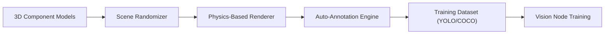

<p align="center">
  
</p>

# 🎲 HYDRA-UMC-SYNTHETIC-DATA-GEN

<p align="center"><a href="README.md">🇺🇸 English</a> | <a href="README_spa.md">🇪🇸 Español</a> | <a href="README_fra.md">🇫🇷 Français</a> | <a href="README_ita.md">🇮🇹 Italiano</a> | <a href="README_deu.md">🇩🇪 Deutsch</a> | <a href="README_zho.md">🇨🇳 简体中文</a> | 🇯🇵 <b>日本語</b></p>

### 📸 ビジョン AI ノードの学習向けプロシージャルデータセットジェネレーター

<p align="left">
  
  
  
</p>

---

## 1. 🛠️ 技術概要

**HYDRA-UMC-SYNTHETIC-DATA-GEN** は、ビジョン AI ノードのためのデータ
工場です。デジタルツインの物理エンジンとレンダリングエンジンを活用し、
ニューラルネットワークの学習用にラベル付けされた画像を数千枚単位で
プロシージャルに生成します。

自動的にピクセル単位で正確な注釈（バウンディングボックス、セグメン
テーションマスク、キーポイント）が付与されたフォトリアリスティックな
3D シナリオを作成することで、新しい工業部品や稀な欠陥タイプにおける
「コールドスタート」問題を解決します。

### 主な機能：
* 🎲 **プロシージャルシナリオ（v0）：** シード指定による実際の決定論的な、2D コンポーネントの位置・サイズ・色のランダム化。*（実際の 2D プレースホルダー形状として実装済み——HYDRA-UMC-TWIN のエンジンを通じた 3D の姿勢/照明/テクスチャはまだです。下記の「ビルドと実行」を参照）*
* 📸 **マルチカメラレンダリング：** 8 台以上の仮想カメラから同時にビューを生成します。*（計画中——HYDRA-UMC-TWIN の実際のレンダリングエンジンが必要です）*
* 🏷️ **自動ラベリング（v0）：** YOLO と COCO への実際のピクセル単位で正確なエクスポート。*（YOLO/COCO について実装済み。TFRecord エクスポートは計画中）*
* 🛠️ **欠陥注入（v0）：** コンポーネントごとの実際のランダムな矩形オーバーレイ、確率は設定可能。*（シンプルな実際のオーバーレイとして実装済み——実際の傷/部品欠落/はんだブリッジ形状は計画中）*
* 📋 **データセットマニフェストと検証（v0）：** `generate` を実行するたびに、実際の `manifest.json`（再現可能シードのフラグ、生成パラメータ、各画像の実際の sha256 チェックサム）が書き込まれ、実際の生成後検証——シーン境界、既知の実際のファイルレイアウトに対する BMP の整合性、ラベル分布の妥当性——が実行されます。実際の問題が見つかった場合はゼロ以外の終了コードで終了します。

---

## 2. 🔄 生成パイプライン



---

## 3. 🧱 アーキテクチャと設計上の決定

* **本ジェネレーターに `hardware/`/`firmware/`/`os/` フォルダがない理由。** 純粋なソフトウェアです——HYDRA-UMC-TWIN 自身のエンジンを通じてシーンをレンダリングするだけで、自らハードウェアを所有していません。
* **HYDRA-UMC-TWIN のサブモジュールではなく兄弟プロジェクトである理由。** データセット生成はバッチ処理のオフラインワークロード（レンダリングに数時間かかることもあります）であり、ツイン自身のリアルタイムループとは根本的に異なります——これを独立させておくことで、長時間のエクスポート処理が同一プロセスの CPU/GPU 時間をリアルタイムシミュレーションと奪い合うことは決してありません。
* **エントリポイントが今日は身元/バージョン/役割のみを表示する理由。** 足場（アンダミアヘ、スキャフォールディング）段階にあります：本パッケージが正しくインストールされ、問題なくインポートできることを証明することが、実際のプロシージャルなランダム化/レンダリング/アノテーションエクスポートロジックに先立ちます。
* **エコシステムの他の部分との関係。** HYDRA-UMC-TWIN 自身のエンジンを通じて、（自動 YOLO/COCO/TFRecord アノテーション付きの）学習データセットをレンダリングし、HYDRA-UMC-VISION-NODE と HYDRA-UMC-DETECTION-HEF がそれを用いて学習できるようにします——実際のカメラ映像を手作業でラベリングする代わりに、合成データを使用します。
* **v0 が HYDRA-UMC-TWIN を待たずに実際の 2D プレースホルダー形状をレンダリングする理由。** HYDRA-UMC-TWIN（本プロジェクト自身の統合親プロジェクト）自体がまだ足場段階にあります——データセット生成を実際の 3D エンジンに完全に依存させると、アノテーションパイプライン（配置、ラベリング、YOLO/COCO エクスポートという、実際に難しく再利用可能な部分）が未テストのまま残ってしまいます。標準ライブラリのみに依存する実際の BMP ラスタライザーは、今日すでに実際のピクセル単位で正確な正解データを提供します——後で TWIN の実際のエンジンに置き換えても、変わるのはピクセルの描画方法だけで、`Scene`/`Component`/エクスポートの契約は変わりません。
* **バウンディングボックスが構造的にピクセル単位で正確である理由。** `export.py` は `scene.py` が配置し `render.py` が描画したのとまったく同じ `Component` の座標を読み取ります——この v0 のループには検出モデルも手動ラベリングの手順も存在しないため、アノテーションがそこからずれる余地がありません。
* **検証が独立した第二のパーサーではなく `render.py` 自身の行サイズ計算式を再利用する理由。** `validate_bmp_integrity()` は BMP の行パディング計算を再度導出するのではなく、`render.py` から `_row_size()` を直接インポートします——正確なバイトレイアウトについて単一の真実の情報源を持つことで、将来ライター側に加えられる実際の変更がチェッカーと気づかぬうちに食い違ってしまうことを防ぎます。
* **「再現可能」が `--seed` の暗黙のプロパティではなく、マニフェストのフィールドである理由。** この変更以前から `--seed` は生成を決定論的にしていましたが、ディスク上の特定のデータセットが実際にシードを使用したかどうかを記録するものは何もありませんでした——利用者は後から再現可能な実行とランダムな実行を区別する手段を持っていませんでした。`manifest.json` の `reproducible` フラグと各画像の実際の sha256 により、この主張が検証可能になります。

---

## 📂 リポジトリ構成

純粋なソフトウェアのデータセットジェネレーターであり、独自のハード
ウェア設計を持たないため、本プロジェクトは `hardware/`、`firmware/`、
`os/` フォルダを携えておらず、リポジトリ構造ポリシーに従っています。

```text
HYDRA-UMC-SYNTHETIC-DATA-GEN/
├── src/hydra_umc_synthetic_data_gen/
│   ├── __init__.py            # パッケージバージョン
│   ├── scene.py          # 実際のプロシージャルな 2D シーン/コンポーネント生成
│   ├── render.py          # 実際の、標準ライブラリのみによる BMP ラスタライズ
│   ├── export.py           # 実際の YOLO/COCO アノテーションエクスポート
│   ├── manifest.py           # 実際のデータセット manifest.json（シード、チェックサム）
│   ├── validate.py           # 実際の境界/BMP 整合性/分布の検証
│   └── main.py               # エントリポイント + 実際の `generate` サブコマンド
├── tests/               # 実際のテスト：生成、レンダリング、エクスポート、エンドツーエンド CLI
├── docs/                # ドキュメントとプロシージャル生成ガイド
├── build/               # ビルド出力（ローカルの .venv もリポジトリルートに存在）
├── images/              # メディアと図表
├── tools/               # ci_validate.py —— CI が使用する manifest/CHANGELOG/docs の検証
├── pyproject.toml       # パッケージメタデータ、依存関係、オドメーターバージョン
├── bump_version.py      # オドメーター式バージョンインクリメント（build.sh/.bat が使用）
├── bump_manifest_version.py # hydra-umc.project.json のバージョンをネイティブ側と同期（--sync）
├── build.sh / build.bat # venv + editable インストール（dev エクストラ付き）+ 実際のテスト + コンパイルチェック
└── run.sh / run.bat     # ローカル venv からエントリポイントを実行（引数を転送、例：`generate`）
```

---

## 🏗️ ビルドと実行

Python 3.10+ が必要です。

```bash
# Linux / macOS
./build.sh   # オドメーター式バージョンインクリメント、.venv を作成し、
             # パッケージを editable モード（dev エクストラ付き）で
             # インストールし、実際のテストスイートを実行し、
             # src/ 全体をコンパイルチェックします
./run.sh     # .venv からエントリポイントを実行し、名前 + バージョン + 役割を表示します
```

```bat
:: Windows
build.bat
run.bat
```

`build.sh`/`build.bat` は、実際の各ビルドの前に、エコシステムの
「オドメーター」規則（PATCH+1、9 を超えると MINOR に繰り上がる）に
従って本プロジェクト自身の `pyproject.toml` のバージョンを増加させ、
実際のテストスイートを実行し（`pytest tests/`）、その後
`python -m compileall` でソースをコンパイルチェックします。

実際の `generate` サブコマンドは、実際のデータセットをディスクに
書き込みます：

```bash
./run.sh generate --out dataset/ --count 20 --components 6 --defect-rate 0.3 --seed 42 --format both

# Windows
run.bat generate --out dataset\ --count 20 --components 6 --defect-rate 0.3 --seed 42 --format both
```

`--format` に応じて、実際の BMP 画像を `dataset/images/` に、実際の
YOLO ラベルを `dataset/labels/` + `dataset/classes.txt` に、および/または
実際の `dataset/annotations.json`（COCO 形式）を書き込みます。特定の
`--seed` を指定すると、データセットはバイト単位で再現可能になります。

各実行は実際の `dataset/manifest.json` も書き込み、自身の出力を検証します：

```
Generated 20 scene(s) -> dataset/images
Total labeled components (incl. defects): 132
Annotations exported as: both
Reproducible seed: yes (seed=42)
Manifest written -> dataset/manifest.json
Validation: OK (scene bounds, BMP integrity, label distribution)
```

```json
{
  "seed": 42,
  "reproducible": true,
  "count": 20,
  "scenes": [
    { "image": "scene_0000.bmp", "num_components": 7,
      "label_counts": {"bolt": 3, "gear": 2, "defect": 2},
      "sha256": "7a422d05948fa43f04e738716883841ee1f493449c1023bc8dc711ffe7ffca2c" }
  ],
  "validation_issues": []
}
```

検証で実際の問題（境界を超えたコンポーネント、切り詰められた/破損した BMP
ファイル、`--defect-rate` から大きく外れた欠陥率）が見つかった場合、
`generate` は終了コード `1` で終了し、欠陥のあるデータセットを黙って
出荷する代わりに、すべての問題を一覧表示します。

---

## 🚀 ロードマップ
* **フェーズ 1：** リアルタイムハードウェアテレメトリとのデジタルツイン同期、サブ 10ms の遅延。
* **フェーズ 2：** 産業グレードのシミュレーター（Isaac Sim）との Physics Replica 統合、変形体サポート。
* **フェーズ 3：** 分散型フェイルオーバーと早期センサー劣化検知のためのノード自己修復自動化パターン。
* **フェーズ 4：** 超リアルな産業用素材のための GAN ベースのテクスチャリファインメントとフォトリアリスティックなデータセット生成。

---

## 🔗 関連プロジェクト

本プロジェクトは、同一著者（JuanenRac / Electro Hobby 3D）による、
ファームウェア、制御ソフトウェア、AI ノード、フリート管理ツールにまたがる、
より大きなロボティクスエコシステムの一部です。ご要望が実際にはこれらの
プロジェクトのいずれかに関するものであり、本リポジトリのものではない
可能性もあるため、知っておく価値があります。

### プロジェクトファミリー

**親プロジェクト：** **[HYDRA-UMC-TWIN](https://github.com/JuanenRac/HYDRA-UMC-TWIN)** —— そのエンジンが本プロジェクトのデータセットをレンダリングする統合親プロジェクト。

**兄弟プロジェクト：**
- **[HYDRA-UMC-PHYSICS-REPLICA](https://github.com/JuanenRac/HYDRA-UMC-PHYSICS-REPLICA)** —— 同じ親プロジェクトを持つ兄弟シミュレーションサービス。
- **[HYDRA-UMC-HIL-BRIDGE](https://github.com/JuanenRac/HYDRA-UMC-HIL-BRIDGE)** —— 同じ親プロジェクトを持つ兄弟シミュレーションサービス。

### 直接関連（ファミリー外）

- **[HYDRA-UMC-VISION-NODE](https://github.com/JuanenRac/HYDRA-UMC-VISION-NODE)** —— 本プロジェクトが生成するデータセットで学習されます。
- **[HYDRA-UMC-DETECTION-HEF](https://github.com/JuanenRac/HYDRA-UMC-DETECTION-HEF)** —— 本プロジェクトが生成するデータセットで学習されます。

### エコシステムのその他のプロジェクト

**HYDRA-UMC プラットフォーム** — マルチロボット・マイクロファクトリーセル
- **[HYDRA-UMC](https://github.com/JuanenRac/HYDRA-UMC)** — 最大 8 台のロボットアームを統括する CM5 + STM32H745 マザーボード。
- **[HYDRA-UMC-SERVER](https://github.com/JuanenRac/HYDRA-UMC-SERVER)** — すべての制御クライアントが接続する Express/WebSocket バックエンド。
- **[HYDRA-UMC-STUDIO](https://github.com/JuanenRac/HYDRA-UMC-STUDIO)** — Web ベースの制御ダッシュボード、マルチロボット 3D 可視化。
- **[HYDRA-UMC-ANDROID-CONTROL](https://github.com/JuanenRac/HYDRA-UMC-ANDROID-CONTROL)** — Wi-Fi/Bluetooth 経由の Android 制御アプリ。
- **[HYDRA-UMC-IOS-CONTROL](https://github.com/JuanenRac/HYDRA-UMC-IOS-CONTROL)** — Flutter で構築された iOS/iPadOS 制御アプリ。
- **[HYDRA-UMC-SUITE](https://github.com/JuanenRac/HYDRA-UMC-SUITE)** — デスクトップ版群制御コマンドセンター（Python/PySide6）。
- **[HYDRA-UMC-EDITOR-URDF](https://github.com/JuanenRac/HYDRA-UMC-EDITOR-URDF)** — ロボットカタログ向けのデスクトップ版 URDF モデルエディター。
- **[HYDRA-UMC-DSI](https://github.com/JuanenRac/HYDRA-UMC-DSI)** — 機載 DSI タッチスクリーン用のネイティブタッチ UI。

**URTC プラットフォーム** — すべての HYDRA-UMC ロボットアームが搭載するツールヘッドコントローラー
- **[URTC](https://github.com/JuanenRac/URTC)** — CAN バスツールヘッドコントローラー、25 種類のツールプロファイル。
- **[URTC-FLASHER](https://github.com/JuanenRac/URTC-FLASHER)** — デスクトップ版 CAN-OTA + SWD/JTAG フラッシュツール。
- **[URTC-TESTER](https://github.com/JuanenRac/URTC-TESTER)** — デスクトップ版ライブ CAN バス診断ツール。
- **[URTC-WEB-STUDIO](https://github.com/JuanenRac/URTC-WEB-STUDIO)** — Web Serial API によるブラウザベースの代替版。

**🎥 ビジョン AI ノード（Hailo-8）**
- [HYDRA-UMC-VISION-NODE](https://github.com/JuanenRac/HYDRA-UMC-VISION-NODE)
- [HYDRA-UMC-VISION-STREAMER](https://github.com/JuanenRac/HYDRA-UMC-VISION-STREAMER)
- [HYDRA-UMC-DETECTION-HEF](https://github.com/JuanenRac/HYDRA-UMC-DETECTION-HEF)
- [HYDRA-UMC-SAFETY-ZONES](https://github.com/JuanenRac/HYDRA-UMC-SAFETY-ZONES)
- [HYDRA-UMC-VISUAL-SERVOING-API](https://github.com/JuanenRac/HYDRA-UMC-VISUAL-SERVOING-API)

**🧠 認知 AI ノード（Hailo-10）**
- [HYDRA-UMC-COGNITIVE-NODE](https://github.com/JuanenRac/HYDRA-UMC-COGNITIVE-NODE)
- [HYDRA-UMC-VLA-ENGINE](https://github.com/JuanenRac/HYDRA-UMC-VLA-ENGINE)
- [HYDRA-UMC-VOICE-UI](https://github.com/JuanenRac/HYDRA-UMC-VOICE-UI)
- [HYDRA-UMC-SEMANTIC-PLANNER](https://github.com/JuanenRac/HYDRA-UMC-SEMANTIC-PLANNER)
- [HYDRA-UMC-DOCS-QA](https://github.com/JuanenRac/HYDRA-UMC-DOCS-QA)

**🐝 オーケストレーションと群制御**
- [HYDRA-UMC-ORCHESTRATOR](https://github.com/JuanenRac/HYDRA-UMC-ORCHESTRATOR)
- [HYDRA-UMC-SWARM-SYNC](https://github.com/JuanenRac/HYDRA-UMC-SWARM-SYNC)
- [HYDRA-UMC-PATH-PLANNER-3D](https://github.com/JuanenRac/HYDRA-UMC-PATH-PLANNER-3D)
- [HYDRA-UMC-JOB-DISPATCHER](https://github.com/JuanenRac/HYDRA-UMC-JOB-DISPATCHER)
- [HYDRA-UMC-NODE-HEALING](https://github.com/JuanenRac/HYDRA-UMC-NODE-HEALING)

**📊 データと分析**
- [HYDRA-UMC-DATALAKE](https://github.com/JuanenRac/HYDRA-UMC-DATALAKE)
- [HYDRA-UMC-TELEMETRY-COLLECTOR](https://github.com/JuanenRac/HYDRA-UMC-TELEMETRY-COLLECTOR)
- [HYDRA-UMC-ANOMALY-DETECTOR](https://github.com/JuanenRac/HYDRA-UMC-ANOMALY-DETECTOR)
- [HYDRA-UMC-PRODUCTION-REPORTS](https://github.com/JuanenRac/HYDRA-UMC-PRODUCTION-REPORTS)

**🏭 産業用ゲートウェイ**
- [HYDRA-UMC-GATEWAY-INDUSTRIAL](https://github.com/JuanenRac/HYDRA-UMC-GATEWAY-INDUSTRIAL)
- [HYDRA-UMC-OPCUA-SERVER](https://github.com/JuanenRac/HYDRA-UMC-OPCUA-SERVER)
- [HYDRA-UMC-MQTT-BROKER](https://github.com/JuanenRac/HYDRA-UMC-MQTT-BROKER)
- [HYDRA-UMC-MTCONNECT-ADAPTER](https://github.com/JuanenRac/HYDRA-UMC-MTCONNECT-ADAPTER)

**🛠️ 補完ツール**
- [URTC-SMART-RACK](https://github.com/JuanenRac/URTC-SMART-RACK)
- [URTC-VISION-TOOL](https://github.com/JuanenRac/URTC-VISION-TOOL)
- [HYDRA-UMC-WATCH](https://github.com/JuanenRac/HYDRA-UMC-WATCH)
- [HYDRA-UMC-TOOL-CLI](https://github.com/JuanenRac/HYDRA-UMC-TOOL-CLI)
- [HYDRA-UMC-DASHBOARD-AI](https://github.com/JuanenRac/HYDRA-UMC-DASHBOARD-AI)


## 👤 作者
**JuanenRac** (Electro Hobby 3D)
📧 electrohobby3d@gmail.com
📺 [youtube.com/@electrohobby3d](https://youtube.com/@electrohobby3d)

## 📜 ライセンス
GPL-3.0 —— 詳細は LICENSE を参照してください。
