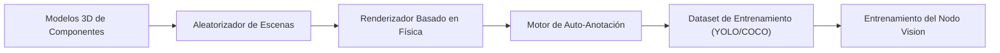

<p align="center">
  
</p>

# 🎲 HYDRA-UMC-SYNTHETIC-DATA-GEN

<p align="center"><a href="README.md">🇺🇸 English</a> | 🇪🇸 <b>Español</b> | <a href="README_fra.md">🇫🇷 Français</a> | <a href="README_ita.md">🇮🇹 Italiano</a> | <a href="README_deu.md">🇩🇪 Deutsch</a> | <a href="README_zho.md">🇨🇳 简体中文</a> | <a href="README_jpn.md">🇯🇵 日本語</a></p>

### 📸 Generador de Datasets Procedurales para Entrenamiento del Nodo Vision AI

<p align="left">
  
  
  
</p>

---

## 1. 🛠️ VISIÓN GENERAL TÉCNICA

**HYDRA-UMC-SYNTHETIC-DATA-GEN** es la fábrica de datos para el Nodo Vision AI. Aprovecha los motores de física y renderizado del Digital Twin para generar proceduralmente miles de imágenes etiquetadas para el entrenamiento de redes neuronales.

Resuelve el problema del "arranque en frío" para nuevos componentes industriales o tipos de defectos raros mediante la creación de escenarios 3D fotorrealistas con anotación automática perfecta a nivel de píxel (bounding boxes, máscaras de segmentación y puntos clave).

### Características Clave:
* 🎲 **Escenarios Procedurales (v0):** Aleatorización real y determinista (con semilla) de la posición, tamaño y color de componentes 2D. *(implementado como formas 2D reales de marcador de posición, todavía no poses/iluminación/texturas 3D a través del motor de HYDRA-UMC-TWIN - ver BUILD Y RUN abajo)*
* 📸 **Renderizado Multi-Cámara:** Genera vistas simultáneas desde más de 8 cámaras virtuales. *(planeado - necesita el motor de renderizado real de HYDRA-UMC-TWIN)*
* 🏷️ **Etiquetado Automático (v0):** Exportación real y perfecta a nivel de píxel en YOLO y COCO. *(implementado para YOLO/COCO; la exportación TFRecord está planeada)*
* 🛠️ **Inyección de Defectos (v0):** Superposición rectangular real y aleatoria por componente, con probabilidad configurable. *(implementado como una superposición real simple - formas reales de arañazo/pieza faltante/puente de soldadura están planeadas)*
* 📋 **Manifiesto de Dataset y Validación (v0):** Cada ejecución de `generate` escribe un `manifest.json` real (semilla reproducible, parámetros de generación y un checksum sha256 real por imagen) y ejecuta una validación real posterior a la generación - límites de escena, integridad BMP contra el layout de archivo real conocido, y sanidad de distribución de etiquetas - saliendo con código distinto de cero si encuentra algún problema real.

---

## 2. 🔄 PIPELINE DE GENERACIÓN



---

## 3. 🧱 ARQUITECTURA Y DECISIONES DE DISEÑO

* **Por qué este generador no tiene carpetas `hardware/`/`firmware/`/`os/`.** Software puro - renderiza escenas a través del propio motor de HYDRA-UMC-TWIN en vez de poseer hardware propio.
* **Por qué es hermano, no un submódulo, de HYDRA-UMC-TWIN.** La generación de datasets es una carga de trabajo por lotes, sin conexión (potencialmente horas de renderizado) fundamentalmente distinta del propio bucle en tiempo real del gemelo - mantenerla separada significa que una exportación larga nunca compite con la simulación en tiempo real por la CPU/GPU del mismo proceso.
* **Por qué el punto de entrada solo imprime identidad/versión/rol hoy.** Etapa de andamiaje: probar que el paquete se instala e importa limpiamente precede a la lógica real de aleatorización procedural/renderizado/exportación de anotaciones.
* **Cómo encaja en el resto del ecosistema.** Renderiza datasets de entrenamiento (con anotación automática YOLO/COCO/TFRecord) a través del propio motor de HYDRA-UMC-TWIN, para que HYDRA-UMC-VISION-NODE y HYDRA-UMC-DETECTION-HEF entrenen con ellos - datos sintéticos en vez de etiquetar a mano vídeo real de cámara.
* **Por qué v0 renderiza formas 2D reales de marcador de posición en vez de esperar a HYDRA-UMC-TWIN.** HYDRA-UMC-TWIN (el propio padre de integración de este proyecto) está todavía en andamiaje - bloquear por completo la generación de datasets a su motor 3D real dejaría sin probar el pipeline de anotación (la parte realmente difícil y reutilizable: colocación, etiquetado, exportación YOLO/COCO). Un rasterizador BMP real, solo con stdlib, da datos reales y perfectos a nivel de píxel hoy; sustituirlo mas adelante por el renderizador real de TWIN solo cambia cómo se pintan los píxeles, no los contratos `Scene`/`Component`/exportación.
* **Por qué las cajas delimitadoras son perfectas a nivel de píxel por construcción.** `export.py` lee las mismas coordenadas exactas de `Component` que `scene.py` colocó y `render.py` pintó - no hay ningún modelo de detección ni paso de etiquetado manual en este bucle de v0 del que las anotaciones puedan desviarse.
* **Por qué la validación reutiliza la propia fórmula de tamaño de fila de `render.py` en vez de un segundo parser independiente.** `validate_bmp_integrity()` importa `_row_size()` de `render.py` directamente en vez de re-derivar el cálculo de relleno de fila BMP - una única fuente de verdad para el layout exacto de bytes evita que un futuro cambio real en el escritor se desincronice silenciosamente del validador.
* **Por qué "reproducible" es un campo del manifiesto y no solo una propiedad implícita de `--seed`.** `--seed` ya hacía la generación determinista antes de este cambio, pero nada registraba si un dataset concreto en disco realmente usó una semilla - un consumidor no tenía forma de distinguir una ejecución reproducible de una aleatoria después del hecho. El campo `reproducible` de `manifest.json` más un sha256 real por imagen hace esa afirmación verificable.

---

## 📂 ESTRUCTURA DE DIRECTORIOS

Generador de datasets puramente software, sin diseño de hardware propio -
por eso este proyecto no lleva carpetas `hardware/`, `firmware/` ni `os/`,
conforme a la política de estructura del repositorio.

```text
HYDRA-UMC-SYNTHETIC-DATA-GEN/
├── src/hydra_umc_synthetic_data_gen/
│   ├── scene.py          # Generación real de escenas/componentes 2D procedurales
│   ├── render.py          # Rasterización real de BMP, solo stdlib
│   ├── export.py           # Exportación real de anotaciones YOLO/COCO
│   ├── manifest.py           # manifest.json real del dataset (semilla, checksums)
│   ├── validate.py           # Validación real de límites/integridad BMP/distribución
│   └── main.py               # Punto de entrada + subcomando real `generate`
├── tests/               # Tests reales: generación, renderizado, exportación, CLI end-to-end
├── docs/                # Documentación y guías procedurales
├── build/               # Salida de build (el .venv local también vive en la raíz del repo)
├── images/              # Medios y diagramas
├── scripts/             # Scripts de utilidad
├── pyproject.toml       # Metadatos del paquete, dependencias, version cuentakilometros
├── bump_version.py      # Bump de version tipo cuentakilometros (usado por build.sh/.bat)
├── build.sh / build.bat # venv + instalación editable (con extras de dev) + tests reales + compile-check
└── run.sh / run.bat     # Ejecuta el entry point desde el venv local (reenvia argumentos, ej. `generate`)
```

---

## 🏗️ BUILD Y RUN

Requiere Python 3.10+.

```bash
# Linux / macOS
./build.sh   # bump de version cuentakilometros, crea .venv, instala el
             # paquete en modo editable (con extras de dev), corre la
             # suite de tests real, compile-check de todo src/
./run.sh     # ejecuta el entry point desde .venv, imprime nombre + version + rol
```

```bat
:: Windows
build.bat
run.bat
```

`build.sh`/`build.bat` incrementan la version del propio `pyproject.toml` de este proyecto siguiendo la regla "cuentakilometros" del ecosistema (PATCH+1, con acarreo a MINOR al pasar de 9) antes de cada build real, corren la suite de tests real (`pytest tests/`), y luego hacen compile-check del código fuente con `python -m compileall`.

El subcomando real `generate` escribe un dataset real en disco:

```bash
./run.sh generate --out dataset/ --count 20 --components 6 --defect-rate 0.3 --seed 42 --format both

# Windows
run.bat generate --out dataset\ --count 20 --components 6 --defect-rate 0.3 --seed 42 --format both
```

Escribe imágenes BMP reales en `dataset/images/`, etiquetas YOLO reales en `dataset/labels/` + `dataset/classes.txt`, y/o un `dataset/annotations.json` real en formato COCO, según `--format`. Una `--seed` dada hace el dataset reproducible byte a byte.

Cada ejecución también escribe un `dataset/manifest.json` real y valida su propia salida:

```
Generated 20 scene(s) -> dataset/images
Total labeled components (incl. defects): 132
Annotations exported as: both
Reproducible seed: yes (seed=42)
Manifest written -> dataset/manifest.json
Validation: OK (scene bounds, BMP integrity, label distribution)
```

```json
{
  "seed": 42,
  "reproducible": true,
  "count": 20,
  "scenes": [
    { "image": "scene_0000.bmp", "num_components": 7,
      "label_counts": {"bolt": 3, "gear": 2, "defect": 2},
      "sha256": "7a422d05948fa43f04e738716883841ee1f493449c1023bc8dc711ffe7ffca2c" }
  ],
  "validation_issues": []
}
```

Si la validación encuentra un problema real (un componente fuera de rango, un BMP truncado/corrupto, o una tasa de defectos que se desvía mucho de `--defect-rate`), `generate` sale con código `1` y lista cada problema en vez de entregar silenciosamente un dataset defectuoso.

---

## 🚀 HOJA DE RUTA
* **Fase 1:** Sincronización de Digital Twin con telemetría de hardware en tiempo real y latencia sub-10ms.
* **Fase 2:** Integración de Physics Replica con simuladores de grado industrial (Isaac Sim) y soporte para cuerpos deformables.
* **Fase 3:** Patrones de recuperación automatizados de Node Healing para failover descentralizado y detección temprana de degradación de sensores.
* **Fase 4:** Refinamiento de texturas basado en GAN para materiales industriales hiperrealistas y generación de datasets fotorrealistas.

---

## 🔗 Proyectos Relacionados

Este proyecto forma parte de un ecosistema de robótica más amplio del mismo autor (JuanenRac / Electro Hobby 3D), que abarca firmware, software de control, nodos de IA y herramientas de flota. Vale la pena conocerlo, ya que una petición podría en realidad ser sobre uno de estos proyectos en vez de sobre este repositorio.

### Familia

**Padre:** **[HYDRA-UMC-TWIN](https://github.com/JuanenRac/HYDRA-UMC-TWIN)** — el padre de integración cuyo motor renderiza los datasets de este proyecto.

**Hermanos:**
- **[HYDRA-UMC-PHYSICS-REPLICA](https://github.com/JuanenRac/HYDRA-UMC-PHYSICS-REPLICA)** — servicio de simulación hermano, mismo padre.
- **[HYDRA-UMC-HIL-BRIDGE](https://github.com/JuanenRac/HYDRA-UMC-HIL-BRIDGE)** — servicio de simulación hermano, mismo padre.

### Relación Directa (fuera de la familia)

- **[HYDRA-UMC-VISION-NODE](https://github.com/JuanenRac/HYDRA-UMC-VISION-NODE)** — entrenado con los datasets que genera este proyecto.
- **[HYDRA-UMC-DETECTION-HEF](https://github.com/JuanenRac/HYDRA-UMC-DETECTION-HEF)** — entrenado con los datasets que genera este proyecto.

### Resto del Ecosistema

**Plataforma HYDRA-UMC** — la célula de micro-fábrica multi-robot
- **[HYDRA-UMC](https://github.com/JuanenRac/HYDRA-UMC)** — la placa base CM5 + STM32H745 que orquesta hasta 8 brazos robóticos.
- **[HYDRA-UMC-SERVER](https://github.com/JuanenRac/HYDRA-UMC-SERVER)** — el backend Express/WebSocket con el que habla cada cliente de control.
- **[HYDRA-UMC-STUDIO](https://github.com/JuanenRac/HYDRA-UMC-STUDIO)** — panel de control web, visualización 3D multi-robot.
- **[HYDRA-UMC-ANDROID-CONTROL](https://github.com/JuanenRac/HYDRA-UMC-ANDROID-CONTROL)** — app de control Android por Wi-Fi/Bluetooth.
- **[HYDRA-UMC-IOS-CONTROL](https://github.com/JuanenRac/HYDRA-UMC-IOS-CONTROL)** — app de control iOS/iPadOS construida en Flutter.
- **[HYDRA-UMC-SUITE](https://github.com/JuanenRac/HYDRA-UMC-SUITE)** — centro de mando de enjambre de escritorio (Python/PySide6).
- **[HYDRA-UMC-EDITOR-URDF](https://github.com/JuanenRac/HYDRA-UMC-EDITOR-URDF)** — editor de modelos URDF de escritorio para el catálogo de robots.
- **[HYDRA-UMC-DSI](https://github.com/JuanenRac/HYDRA-UMC-DSI)** — interfaz táctil nativa para la pantalla DSI integrada.

**Plataforma URTC** — el controlador de cabezal de herramienta que lleva cada brazo HYDRA-UMC
- **[URTC](https://github.com/JuanenRac/URTC)** — controlador de cabezal de herramienta CAN, 25 perfiles de herramienta.
- **[URTC-FLASHER](https://github.com/JuanenRac/URTC-FLASHER)** — herramienta de escritorio de flasheo CAN-OTA + SWD/JTAG.
- **[URTC-TESTER](https://github.com/JuanenRac/URTC-TESTER)** — herramienta de escritorio de diagnóstico CAN en vivo.
- **[URTC-WEB-STUDIO](https://github.com/JuanenRac/URTC-WEB-STUDIO)** — alternativa basada en navegador vía Web Serial API.

**🎥 Vision AI Node (Hailo-8)**
- [HYDRA-UMC-VISION-NODE](https://github.com/JuanenRac/HYDRA-UMC-VISION-NODE)
- [HYDRA-UMC-VISION-STREAMER](https://github.com/JuanenRac/HYDRA-UMC-VISION-STREAMER)
- [HYDRA-UMC-DETECTION-HEF](https://github.com/JuanenRac/HYDRA-UMC-DETECTION-HEF)
- [HYDRA-UMC-SAFETY-ZONES](https://github.com/JuanenRac/HYDRA-UMC-SAFETY-ZONES)
- [HYDRA-UMC-VISUAL-SERVOING-API](https://github.com/JuanenRac/HYDRA-UMC-VISUAL-SERVOING-API)

**🧠 Cognitive AI Node (Hailo-10)**
- [HYDRA-UMC-COGNITIVE-NODE](https://github.com/JuanenRac/HYDRA-UMC-COGNITIVE-NODE)
- [HYDRA-UMC-VLA-ENGINE](https://github.com/JuanenRac/HYDRA-UMC-VLA-ENGINE)
- [HYDRA-UMC-VOICE-UI](https://github.com/JuanenRac/HYDRA-UMC-VOICE-UI)
- [HYDRA-UMC-SEMANTIC-PLANNER](https://github.com/JuanenRac/HYDRA-UMC-SEMANTIC-PLANNER)
- [HYDRA-UMC-DOCS-QA](https://github.com/JuanenRac/HYDRA-UMC-DOCS-QA)

**🐝 Orchestration & Swarm**
- [HYDRA-UMC-ORCHESTRATOR](https://github.com/JuanenRac/HYDRA-UMC-ORCHESTRATOR)
- [HYDRA-UMC-SWARM-SYNC](https://github.com/JuanenRac/HYDRA-UMC-SWARM-SYNC)
- [HYDRA-UMC-PATH-PLANNER-3D](https://github.com/JuanenRac/HYDRA-UMC-PATH-PLANNER-3D)
- [HYDRA-UMC-JOB-DISPATCHER](https://github.com/JuanenRac/HYDRA-UMC-JOB-DISPATCHER)
- [HYDRA-UMC-NODE-HEALING](https://github.com/JuanenRac/HYDRA-UMC-NODE-HEALING)

**📊 Data & Analytics**
- [HYDRA-UMC-DATALAKE](https://github.com/JuanenRac/HYDRA-UMC-DATALAKE)
- [HYDRA-UMC-TELEMETRY-COLLECTOR](https://github.com/JuanenRac/HYDRA-UMC-TELEMETRY-COLLECTOR)
- [HYDRA-UMC-ANOMALY-DETECTOR](https://github.com/JuanenRac/HYDRA-UMC-ANOMALY-DETECTOR)
- [HYDRA-UMC-PRODUCTION-REPORTS](https://github.com/JuanenRac/HYDRA-UMC-PRODUCTION-REPORTS)

**🏭 Industrial Gateway**
- [HYDRA-UMC-GATEWAY-INDUSTRIAL](https://github.com/JuanenRac/HYDRA-UMC-GATEWAY-INDUSTRIAL)
- [HYDRA-UMC-OPCUA-SERVER](https://github.com/JuanenRac/HYDRA-UMC-OPCUA-SERVER)
- [HYDRA-UMC-MQTT-BROKER](https://github.com/JuanenRac/HYDRA-UMC-MQTT-BROKER)
- [HYDRA-UMC-MTCONNECT-ADAPTER](https://github.com/JuanenRac/HYDRA-UMC-MTCONNECT-ADAPTER)

**🛠️ Complementary Tools**
- [URTC-SMART-RACK](https://github.com/JuanenRac/URTC-SMART-RACK)
- [URTC-VISION-TOOL](https://github.com/JuanenRac/URTC-VISION-TOOL)
- [HYDRA-UMC-WATCH](https://github.com/JuanenRac/HYDRA-UMC-WATCH)
- [HYDRA-UMC-TOOL-CLI](https://github.com/JuanenRac/HYDRA-UMC-TOOL-CLI)
- [HYDRA-UMC-DASHBOARD-AI](https://github.com/JuanenRac/HYDRA-UMC-DASHBOARD-AI)


## 👤 AUTOR
**JuanenRac** (Electro Hobby 3D)
📧 electrohobby3d@gmail.com

## 📜 LICENCIA
GPL-3.0 - Ver archivo LICENSE para más detalles.

## 🛠️ BUILD & RUN

Usa la comprobación de compilación sin versionado antes de una compilación de publicación:

| Acción | Windows | Linux / macOS |
|---|---|---|
| Comprobación de compilación (sin cambiar versión ni CHANGELOG) | `build-test.bat` | `./build-test.sh` |
| Ejecución / desarrollo (cuando exista) | `run*.bat` o `dev*.bat` | `./run*.sh` o `./dev*.sh` |

`build-test.bat` y `build-test.sh` compilan o validan el stack del proyecto sin incrementar `hydra-umc.project.json` ni modificar `CHANGELOG.md`. Solo pueden crear salidas normales del compilador. Los scripts existentes `build*.bat`, `build*.sh`, `run*` y `dev*` conservan su comportamiento específico de versión o ejecución; úsalos cuando necesites ese comportamiento.